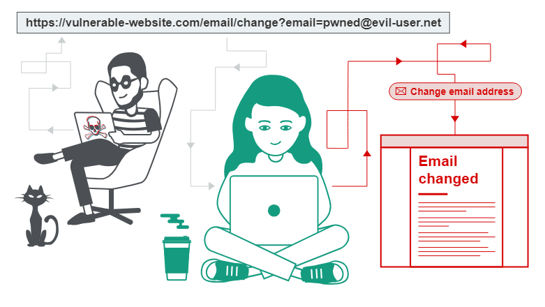

Cross-site request forgery (also known as CSRF) is a web security vulnerability that allows an attacker to trick users into performing actions they did not intend. It allows an attacker to partially bypass the same-origin policy, which is designed to prevent different websites from interfering with each other.

## What are the consequences?
In a successful CSRF attack, the attacker tricks the victim user into performing an action that they did not intend. For example, changing the email address on an account, changing a password, or transferring funds. Depending on the nature of the action, the attacker may gain complete control of the user's account. If the compromised user has a privileged role in the application, the attacker may be able to take over all of the application's data and functionality.