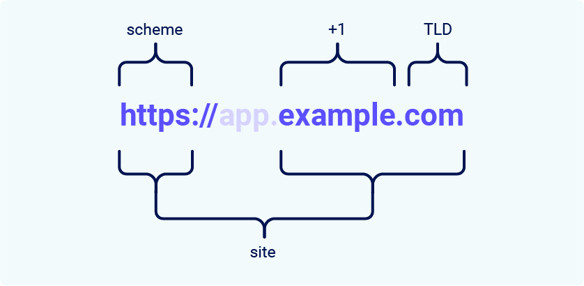

For the purposes of the `SameSite` cookie restrictions, a site is defined as a top-level domain (TLD), typically something like `.com` or `.net`, plus one additional domain name level. This is often referred to as `TLD+1`.
The URL scheme is also taken into account when determining whether a request is cross-site or not. This means that a link from `http://app.example.com` to `https://app.example.com` would be considered cross-site by most browsers.

> **Note**  
> You may come across the term "effective top-level domain" (eTLD). This is simply a way of accounting for reserved multi-part suffixes that are treated as top-level domains in practice, such as `.co.uk`.

The difference between a site and an origin is their scope; site covers multiple domain names, whereas origin only covers one. Although closely related, it is important not to use these terms interchangeably, as mixing them can have serious security implications.
Two URLs are considered to have the same origin if they have exactly the same scheme, domain name, and port. Although it should be noted that the port is often inferred from the scheme.

As you can see from this example, the term "site" is much less specific, as it only takes into account the scheme and the last part of the domain name. Crucially, a cross-origin request can be a same-site request, but not vice versa.

|Request from|Request to|Single-site?|Single-origin?|
|---|---|---|---|
|[https://example.com](https://example.com/)|[https://example.com](https://example.com/)|Yes|Yes|
|[https://app.example.com](https://app.example.com/)|[https://intranet.example.com](https://intranet.example.com/)|Yes|No: Domain name mismatch|
|[https://example.com](https://example.com/)|[https://example.com:8080](https://example.com:8080/)|Yes|No: Port mismatch|
|[https://example.com](https://example.com/)|[https://example.co.uk](https://example.co.uk/)|No: eTLD mismatch|No: Domain name mismatch|
|[https://example.com](https://example.com/)|[http://example.com](http://example.com/)|No: Scheme mismatch|No: Scheme mismatch|
This is an important distinction because it means that any vulnerability that allows arbitrary `JavaScript` to be executed can be used to bypass site-based protections on other domains belonging to the same site. We'll see an example of this in one of the labs later.