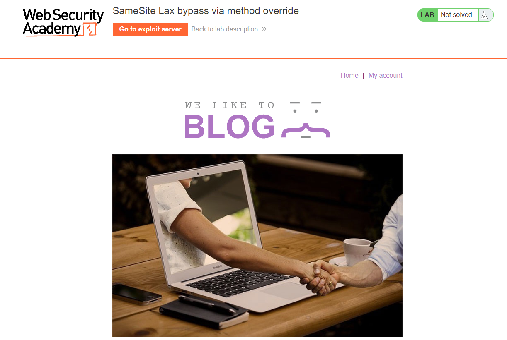
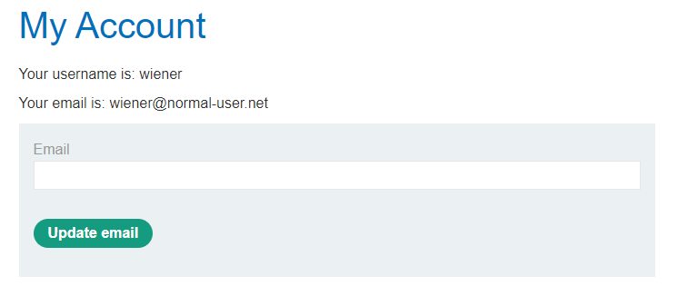
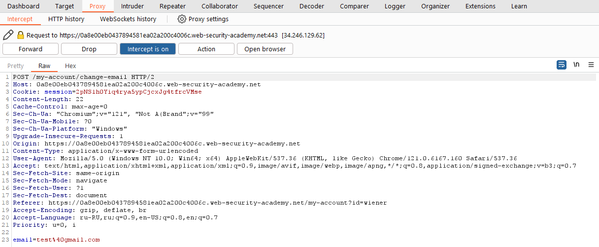
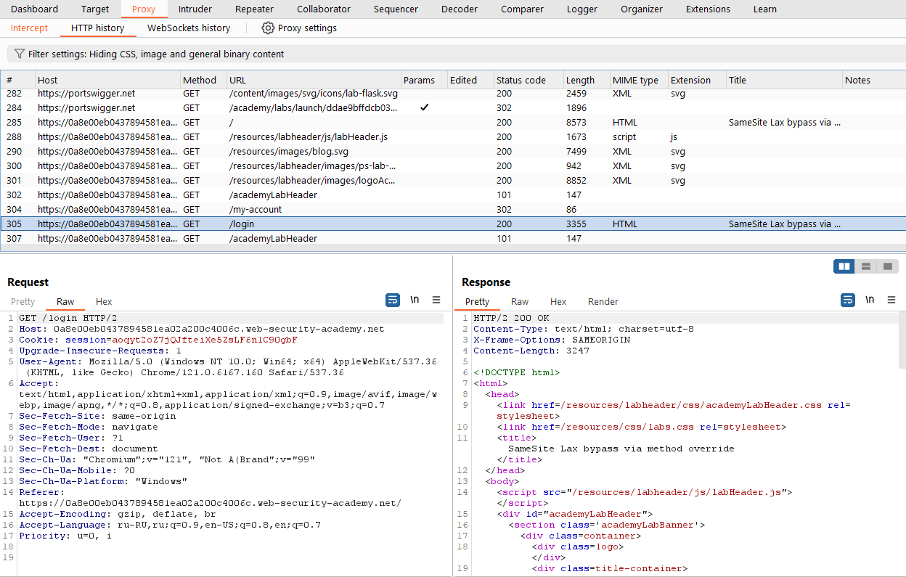
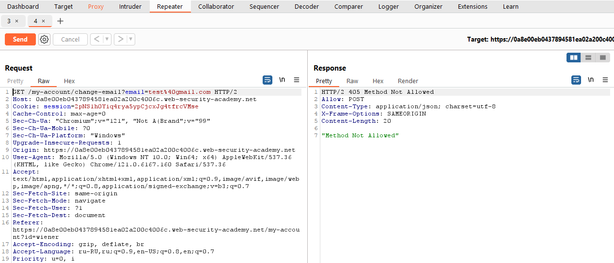
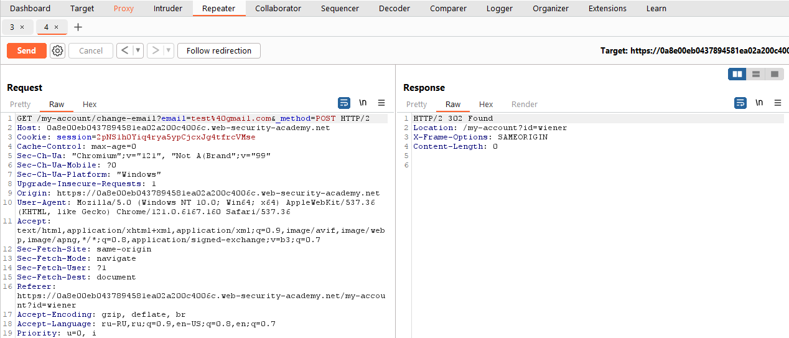
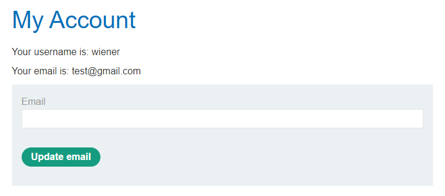
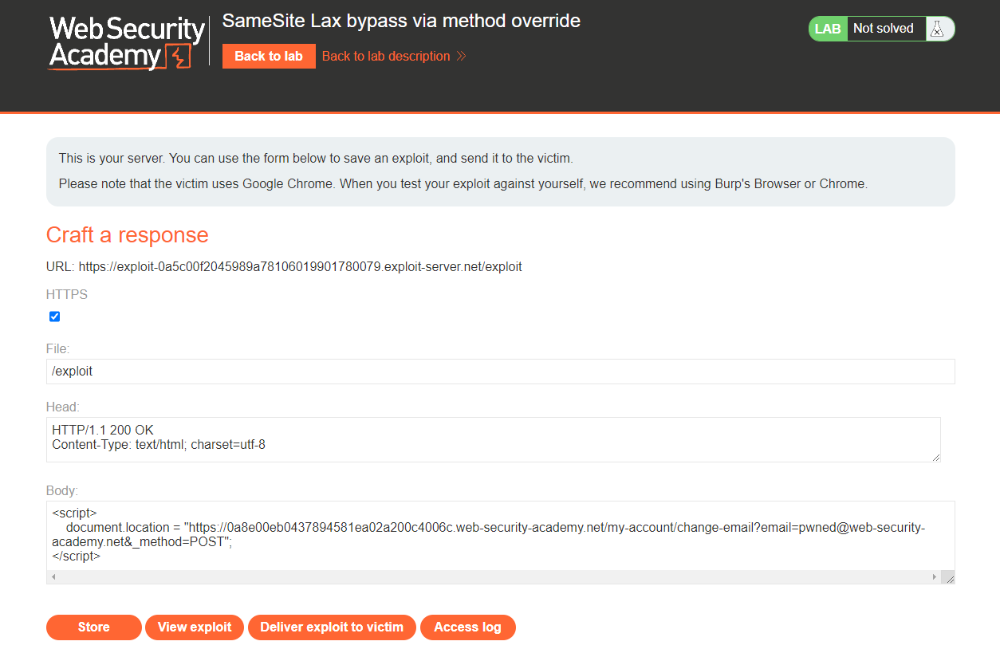
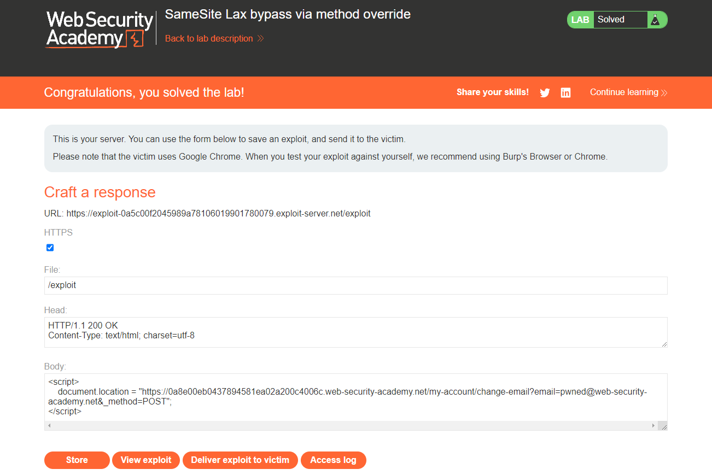

[Source](https://portswigger.net/web-security/csrf/bypassing-token-validation/lab-token-duplicated-in-cookie)
## Task
The email address change functionality in this lab is vulnerable to CSRF. To solve the task, we need to perform a CSRF attack that changes the victim's email address. We should use the provided exploit server to host our attack.
We can log in to our account using the following credentials: `wiener:peter`

> **Note**  
> The default values ​​for SameSite vary across browsers. Since the victim is using Chrome, we recommend also using Chrome (or Burp's built-in Chromium browser) to test the exploit.
## Solution
Go to the task site



Log in as `wiener`



Change email and intercept the request via `Burp Suite`



Examine the `POST /my-account/change-email` request and notice that it does not contain unpredictable tokens, so it may be vulnerable to CSRF if we can bypass the `SameSite cookie` restrictions.
Look at the response to our `POST /login` request. We see that the site does not explicitly specify any `SameSite` settings when setting session `cookies`. As a result, the browser will use the `Lax` level by default.
We understand that this means sending a session `cookie` in cross-site `GET` requests, provided that they occur at the top navigation level.



We send a `POST /my-account/change-email` request to `Repeater` and click `Change request method` in it. We send the request and see that `endpoint` only accepts `POST` requests.



Let's try changing the first line in the request like this:
```Request
GET /my-account/change-email?email=test%40gmail.com&_method=POST HTTP/2
```
Sending the request



We see that the server accepted this request. Go to the account page and see that the email has changed



Open `Exploit Server` and paste the code into the `Body` field
```JS
<script> document.location = "https://YOUR-LAB-ID.web-security-academy.net/my-account/change-email?email=pwned@web-security-academy.net&_method=POST"; </script>
```



Then click `Store` and `Deliver exploit to victim`


