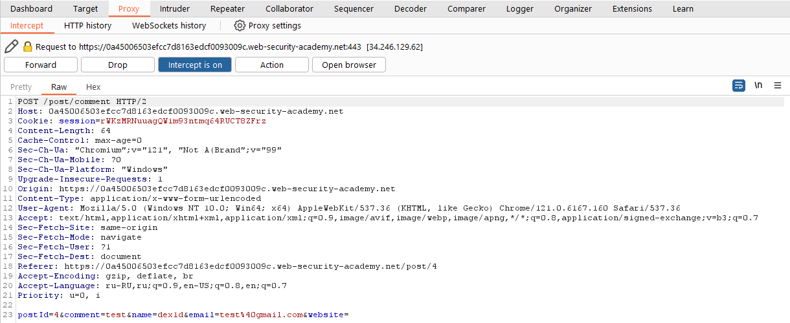
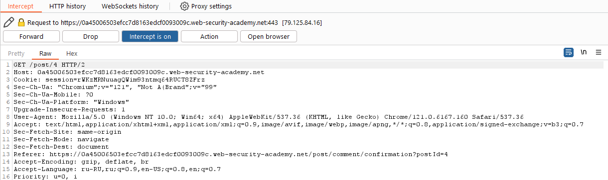

[Source](https://portswigger.net/web-security/csrf/bypassing-samesite-restrictions/lab-samesite-strict-bypass-via-client-side-redirect)
## Task
The email address change functionality in this lab is vulnerable to CSRF. To solve the task, we need to perform a CSRF attack that will change the victim's email address. You should use the provided exploit server to host your attack.
We can log in to our account using the following credentials: `wiener:peter`
## Solution
Go to the task page


Log in as `wiener`


Change email and intercept the request via `Burp Suite`


Inspect the `POST /my-account/change-email` request and notice that it does not have any unpredictable tokens, so it may be vulnerable to CSRF if we can bypass the `SameSite cookie` restrictions.
Look at the response of the `POST /login` request. It says that `SameSite=Strict` when the `cookie` is assigned. This prevents the browser from including these `cookies` in cross-site requests.


Let's go to any post and try to leave a comment





Notice that we are first taken to the confirmation page at `/post/comment/confirmation?postId=x`, but after a few seconds we are returned to the blog post.
Open `Proxy history` and notice that this redirect is handled on the client side using the included `JavaScript` file `/resources/js/commentConfirmationRedirect.js`.


Open the `JavaScript` file and analyze the code. We see that it uses the `postId` parameter in the query string to dynamically generate the path for the client redirect.


In `Proxy history`, right-click on the `GET /post/comment/confirmation?postId=x` request and select `Copy URL`.


```URL
https://0a45006503efcc7d8163edcf0093009c.web-security-academy.net/post/comment/confirmation?postId=4
```
In the browser, we go to the copied URL, but change the `postId` parameter to an arbitrary string, for example:
```URL
/post/comment/confirmation?postId=foo
```


Notice that we initially see the comment confirmation page, and then the client-side JavaScript tries to redirect us to a path containing our embedded string, for example `/post/foo`
Let's try to implement a directory traversal sequence so that the dynamically generated URL leads to our account page:
```URL
/post/comment/confirmation?postId=1/../../my-account
```


We observe that the browser normalizes this URL and indeed leads us to the account page. This confirms that with the `postId` parameter we can make a `GET` request to any `endpoint` on the target site.
In the browser, we go to the `Exploit Server` and create a script that will force the visitor's browser to send the very `GET` request that we just tested. One of the possible options:
```JS
<script>
document.location = "https://YOUR-LAB-ID.web-security-academy.net/post/comment/confirmation?postId=../my-account";
</script>
```


Click `Store` and `View exploit`


We notice that when performing a client redirect, we still end up on our account page, while logged in. This confirms that the browser included our authenticated session `cookie` in the second request, even though the original request to post the comment was initiated from an external site.
Next, we send a `POST /my-account/change-email` request to `Repeater` and change the request method


Send this request. Notice that `endpoint` does indeed allow changing the email address using the `GET` method.


We go back to the `Exploit Server` and change the `postId` parameter in our exploit so that the redirect results in an equivalent `GET` request to change the email address:
```HTML
<script>
document.location = "https://YOUR-LAB-ID.web-security-academy.net/post/comment/confirmation?postId=1/../../my-account/change-email?email=pwned%40web-security-academy.net%26submit=1";
</script>
```


>**Important!**  
>You need to include the `submit` parameter and encode the ampersand (`%26`) to avoid exceeding the `postId` parameter in the original request when configuring.
Click `Store` and `Deliver exploit to victim`. After some time, the lab will be considered completed


