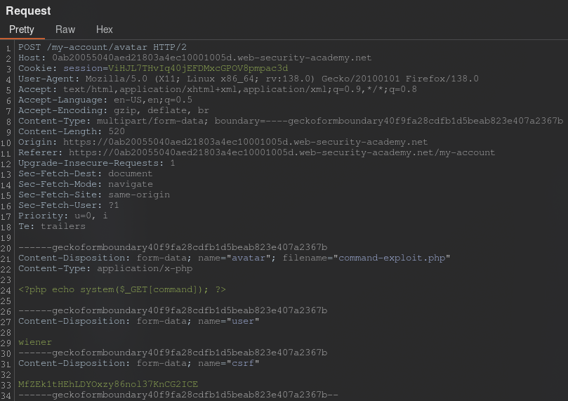
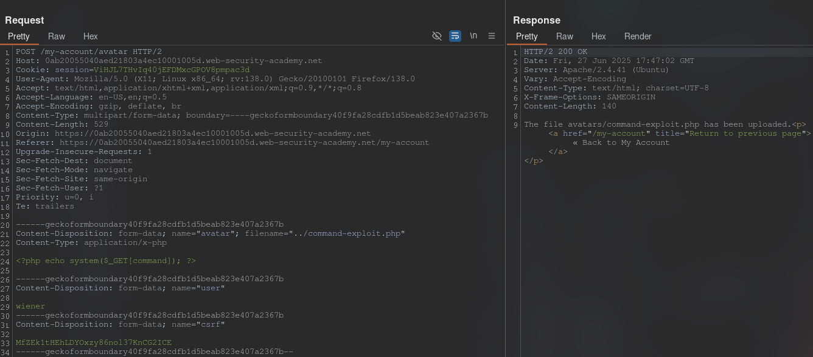
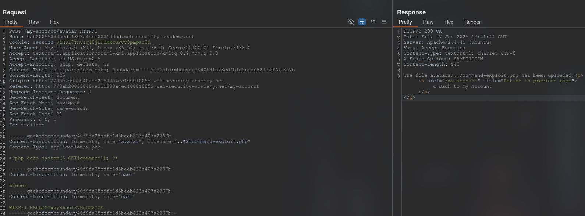
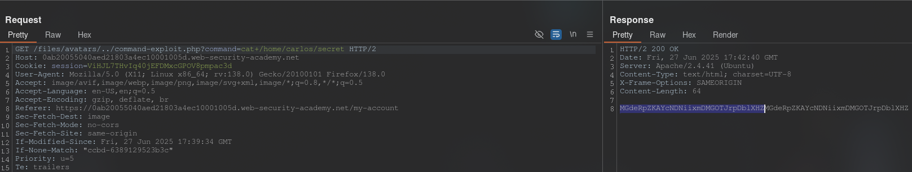
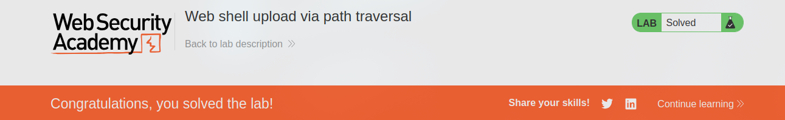

[Source](https://portswigger.net/web-security/file-upload/lab-file-upload-web-shell-upload-via-path-traversal)
## Task
This lab contains a vulnerable image upload function. The server is configured to prevent execution of user-supplied files, but this restriction can be bypassed using a secondary vulnerability.

To solve this task, download a basic PHP web shell and use it to retrieve the contents of the file `/home/carlos/secret`. Submit this secret using the button indicated on the lab banner.

You can log in to your own account using the following credentials: `wiener:peter`.
## Solution
Go to the site and log in to your account. We see that there is an option to upload an image.
Upload any image. In `Burp Suite`, go to `HTTP history`, click on filters and check the `Images` box. In the request history we find a `GET` request with our image. We send it to `Repeater`.


Now let's try to upload a PHP file and send this request to `Repeater`:



We need to upload the file to another directory. To do this, change `filename`:
```Request
filename="../command-exploit.php"
```



>The file avatars/command-exploit.php has been uploaded.

The path to the file has not changed. Let's try replacing `/` with `%2f`:
```Request
filename="..%2fcommand-exploit.php"
```



>The file avatars/../command-exploit.php has been uploaded.

Let's move on to the request that loads the image onto the page. In the first line of the request we add:
```URL
/files/../command-exploit.php?command=cat+/home/carlos/secret
```



```Secret
MGdeRpZKAYcNDNiixmDMGOTJrpDblXHZ
```


