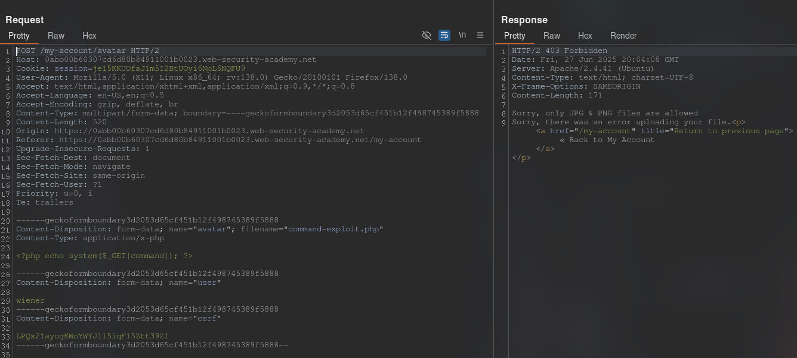
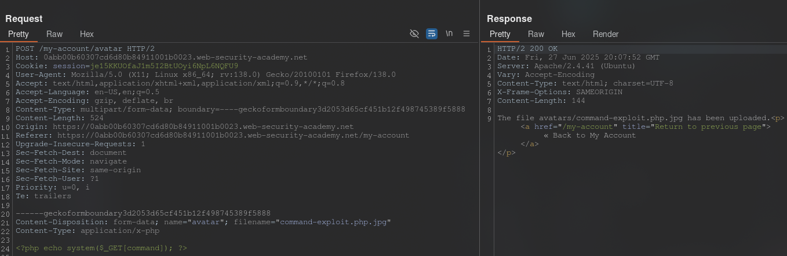
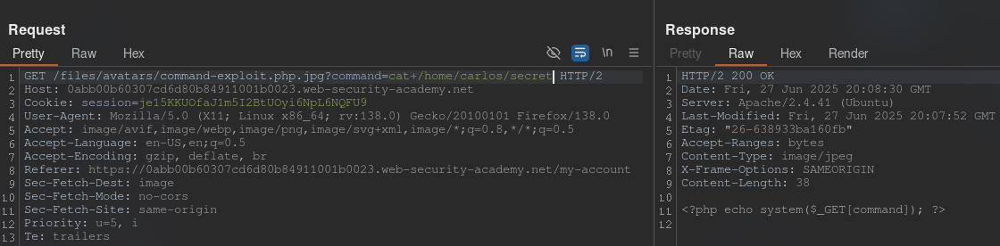
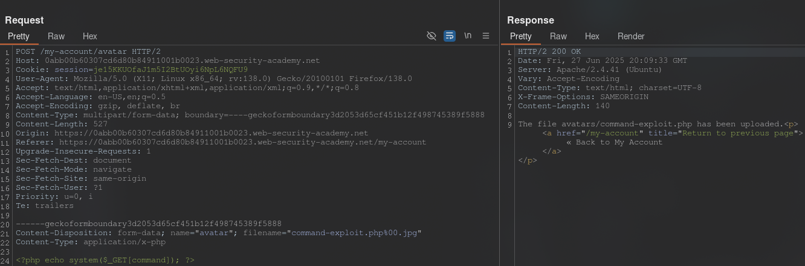
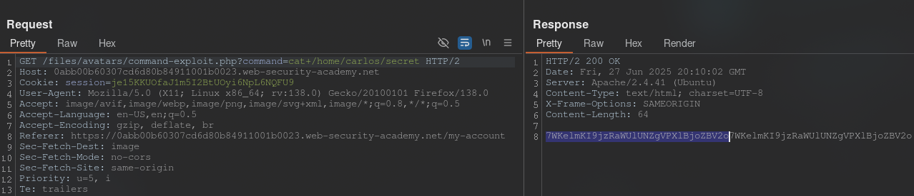
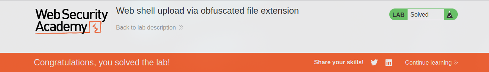

[Source](https://portswigger.net/web-security/file-upload/lab-file-upload-web-shell-upload-via-obfuscated-file-extension)
## Task
This lab contains a vulnerable image upload function. Certain file extensions are blacklisted, but this protection can be bypassed using classic obfuscation techniques.

To solve this task, download a basic PHP web shell and use it to get the contents of the file `/home/carlos/secret`. Submit this secret using the button indicated on the lab banner.

You can log in to your own account using the following credentials: `wiener:peter`.
## Solution
Go to the site and log in to your account. We see that there is an option to upload an image.
Upload any image. In `Burp Suite`, go to `HTTP history`, click on filters and check `Images`. In the request history, find the `GET` request with our image. Send it to `Repeater`.


Now let's try to upload a PHP file and send this request to `Repeater`:



>Sorry, only JPG & PNG files are allowed

The filter only allows files with `.jpg` and `.png`. Let's try to upload the file `command-exploit.php.jpg`






Failed. Let's try to upload the file `command-exploit.php%00.jpg`



>The file avatars/command-exploit.php has been uploaded.

Now let's move on to the request that uploads the image to the page. In the first line of the request we add:
```URL
/files/avatars/command-exploit.php?command=cat+/home/carlos/secret
```



```Secret
7WKelmKI9jzRaWUlUNZgVPXlBjoZBV2o
```


