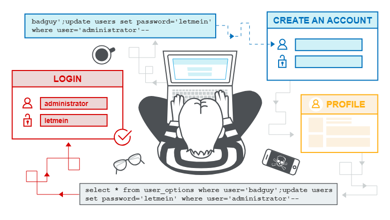

A first-order SQL injection occurs when an application takes user input from an HTTP request and insecurely includes that input in a SQL query.
A second-order SQL injection occurs when an application takes user input from an HTTP request and stores it for later use. This is typically done by writing the data to a database, where the vulnerability is not exposed at the time of saving. Later, in another HTTP request, the application retrieves the stored data and insecurely includes it in a SQL query. This is why a second-order SQL injection is also called a "stored" SQL injection.

A second-order SQL injection often occurs when developers are aware of SQL injection vulnerabilities and therefore safely handle the input at the time the data is saved to the database. However, when the data is subsequently processed, it is considered secure because it was "correctly" written to the database. At this point, the data is processed in an insecure manner because the developer mistakenly believes that it can be trusted.