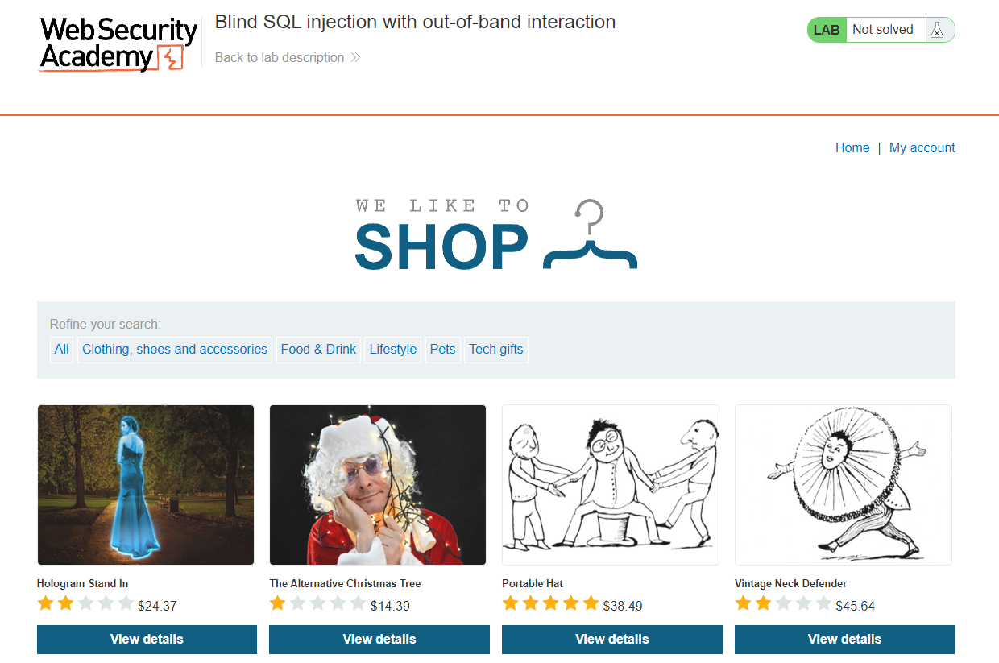
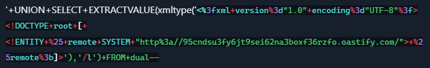
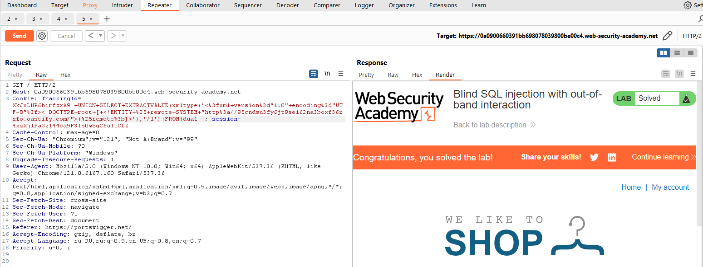

[Source](https://portswigger.net/web-security/sql-injection/blind/lab-out-of-band)
## Task
This lab contains a blind SQL injection vulnerability. The application uses tracking cookies for analytics and executes a SQL query containing the value of the sent cookie.
The SQL query is executed asynchronously and does not affect the application's response. However, we can initiate out-of-band communication with an external domain.
To solve the task, we use the SQL injection vulnerability to initiate a DNS request to Burp Collaborator.

>[!info] Note
To prevent the Academy platform from being used to attack third-party resources, our firewall blocks communication between labs and any external systems. To solve the task, you must use the default public Burp Collaborator server.
## Solution
Go to the website page

In `TrackerId` insert the request:

Erase `95cndsu3fy6jt9sei62na3boxf36rzfo.oastify.com`, right-click on that place and click `Insert Collaborator payload`
Send it.

