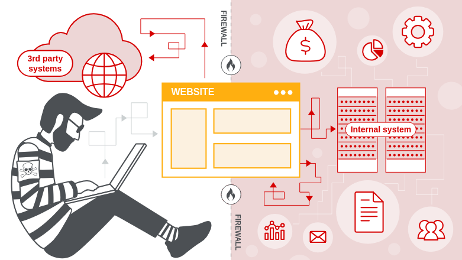

## What is SSRF?
**SSRF (Server-Side Request Forgery)** is a web security vulnerability that allows an attacker to force a server application to make requests to unintended addresses.

In a typical SSRF attack, an attacker can force a server to connect to internal services of an organization's infrastructure that are only accessible from within the network. In other cases, the server can be forced to connect to arbitrary external systems. This can lead to the leakage of sensitive data, such as login credentials.

