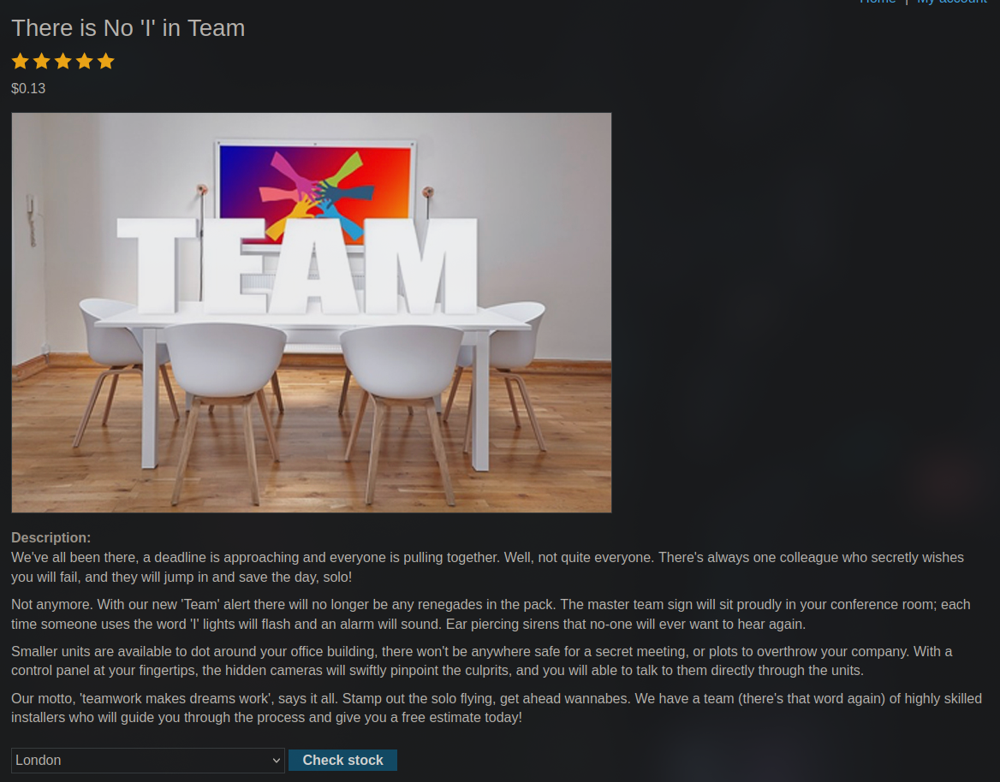
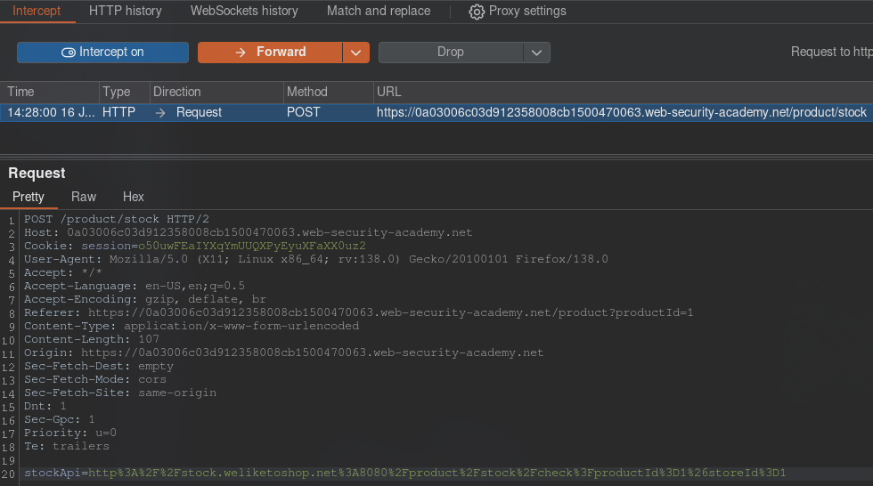
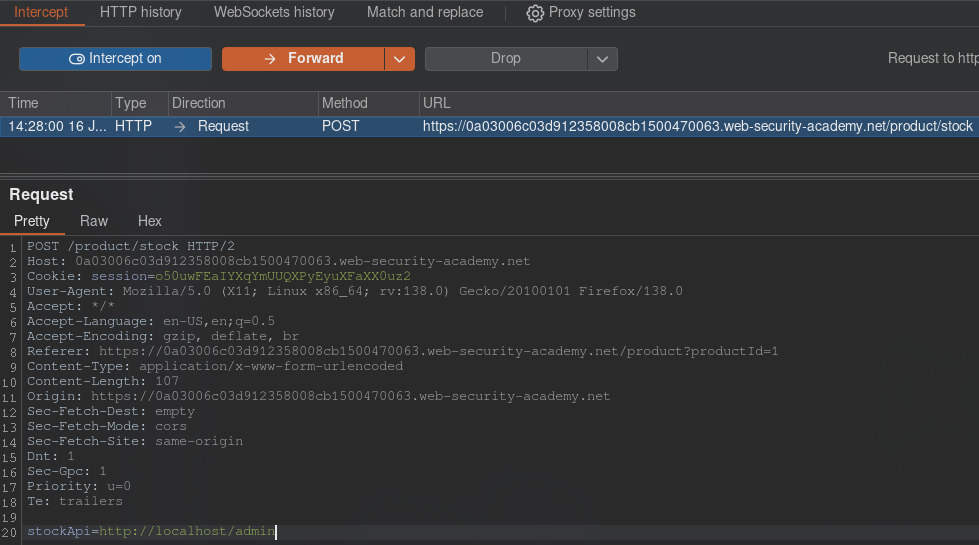
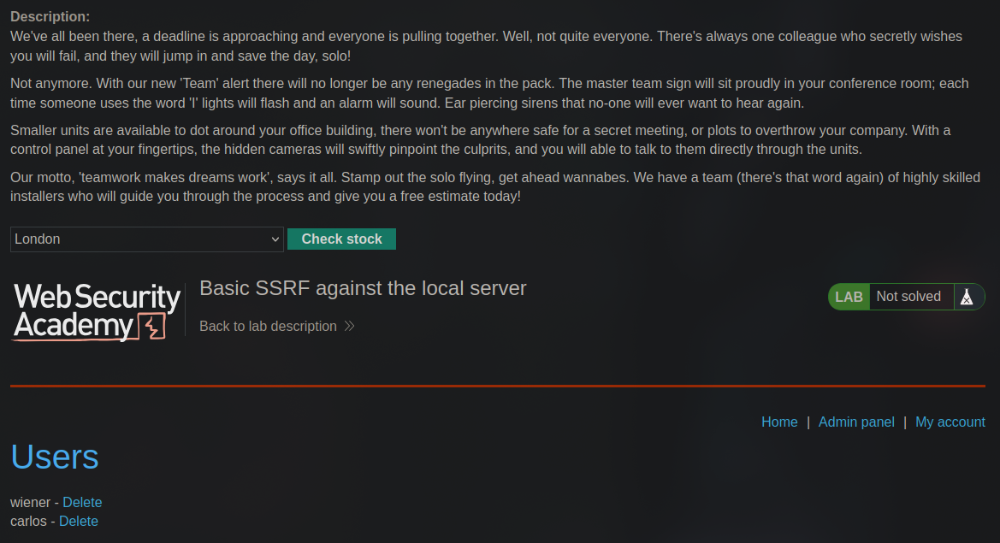
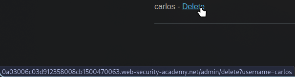
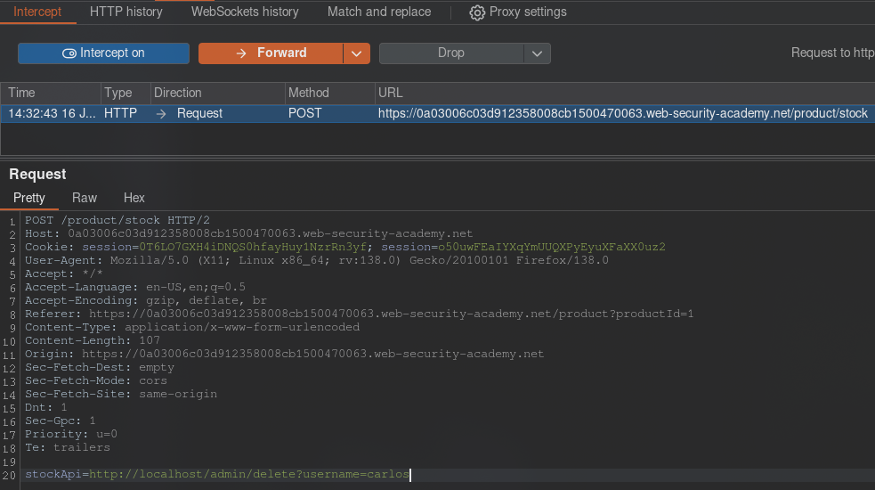
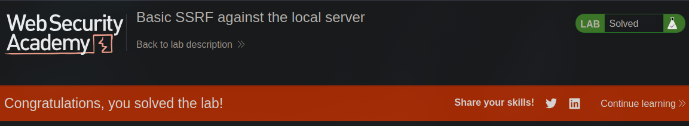

[Source](https://portswigger.net/web-security/ssrf/lab-basic-ssrf-against-localhost)
## Task
To solve the problem, change the stock check URL to access the admin interface at http://localhost/admin and delete the user `carlos`.
## Solution
Go to the lab site and go to any product page. Click `Check stock`.



In `Burp Suite`, intercept the request. We see that there is a request to `API`, which contains the `URL` for checking the availability of the product.



Let's try replacing this link with `http://localhost/admin`:



We send a request and see that the admin panel has appeared on the same product page.



If we hover over `Delete`, we will see a link that deletes the user `Carlos`.



We write the end of this link in the request to check the availability of the product and send the request:
```URL
http://localhost/admin/delete?username=carlos
```



User `Carlos` is deleted, and the lab work is completed.


