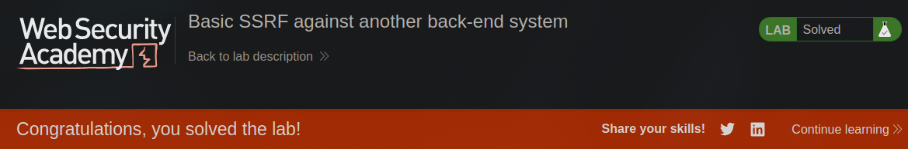

[Source](https://portswigger.net/web-security/ssrf/lab-basic-ssrf-against-backend-system)
## Task
To solve the problem, use the inventory check function to scan the internal range `192.168.0.X` for the admin interface on port `8080`, and then use it to delete the user `carlos`.
## Solution
Open the lab site and go to any product. Check for its availability and intercept the request in `Burp Suite`


Send this request to `Intruder`. We need to iterate over all IP addresses. To do this, generate a list:
```bash
seq 0 256 > 0-256-list.txt
```


Import this list, change the `stockAPI` link to `http://192.168.0.0:8080/admin`, select the last `0` in the address and launch the attack


Only one request returned with the status code `200`. Thus, the correct IP address is `192.168.0.40`. Let's check his access to the admin panel:


The link to delete the user is as follows:
```bash
http://192.168.0.40:8080/admin/delete?username=carlos
```
We send it via the request to check the availability of the product.


User `Carlos` has been deleted, and the lab work has been completed.


