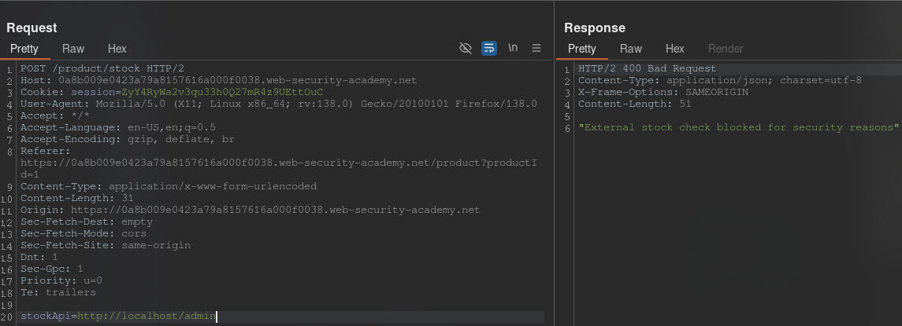
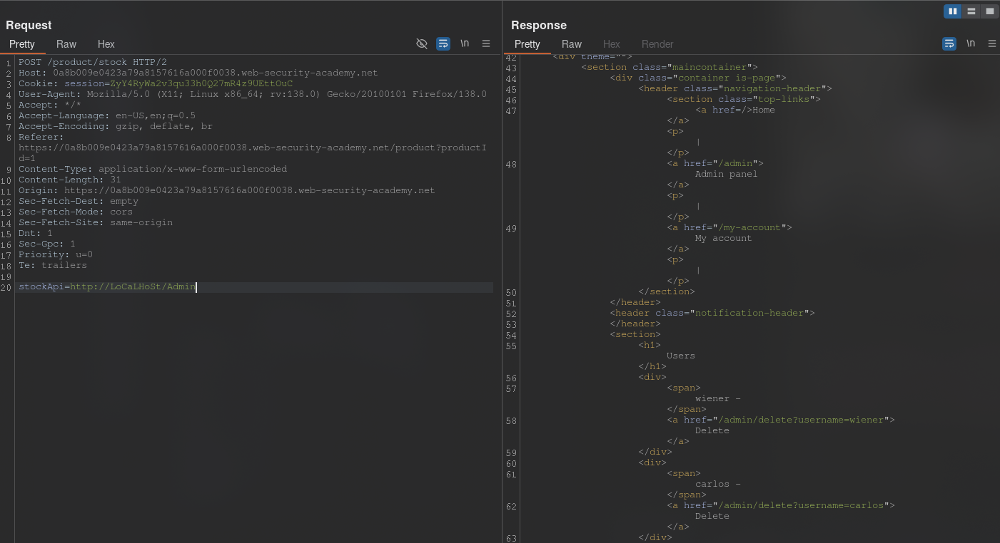
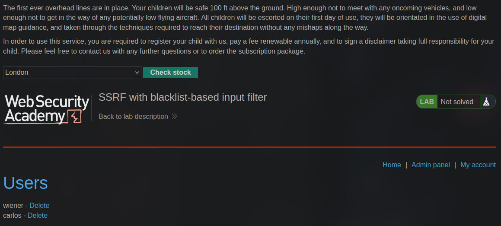
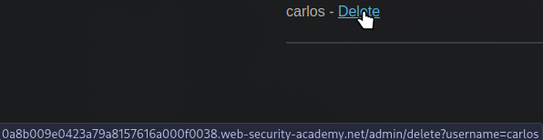
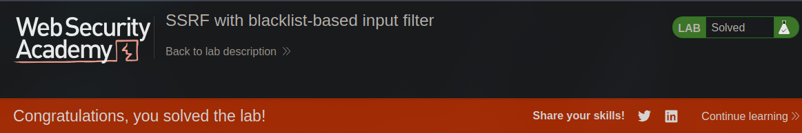

[Source](https://portswigger.net/web-security/learning-paths/ssrf-attacks/ssrf-attacks-circumventing-defenses/ssrf/lab-ssrf-with-blacklist-filter#)
## Task
To solve the task, change the inventory check URL to access the admin interface at http://localhost/admin and remove the user `carlos`.
The developer has installed two weak SSRF protections that you will need to bypass.
## Solution
We open the lab site and go to any product. We check its availability and intercept the request in `Burp Suite`, which we send to `Repeater`.



Simple `http://localhost/admin` is filtered here. Let's try another way
```URL
http://LoCaLHoSt/Admin
```



It worked. Let's check the admin panel and delete the user.






```URL
http://LoCaLHoSt/Admin/delete?username=carlos
```


User `Carlos` is deleted and the lab is done.


