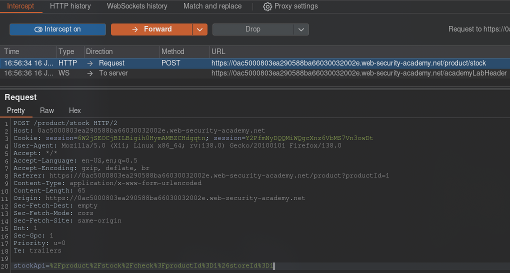
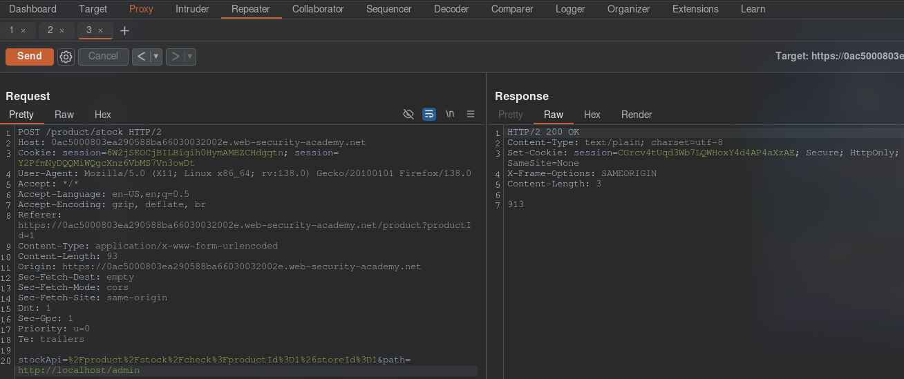
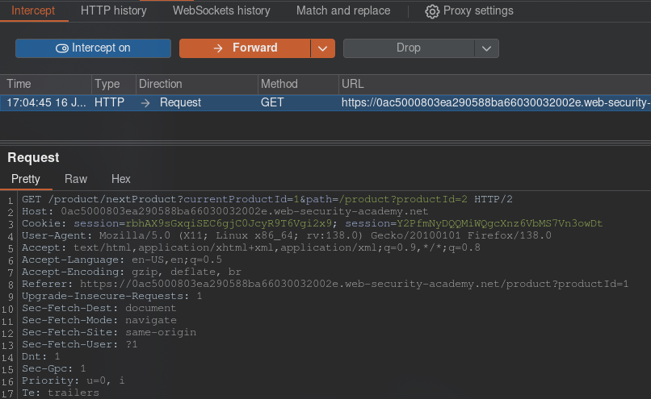
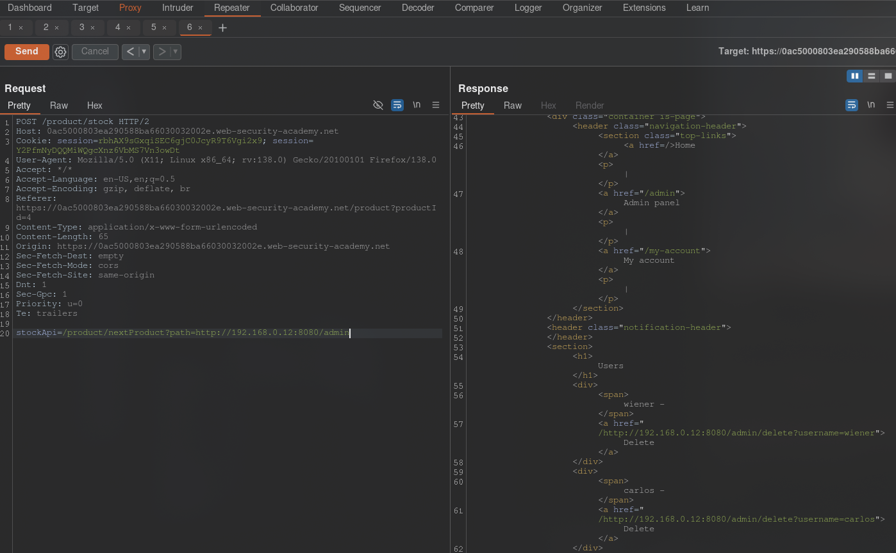
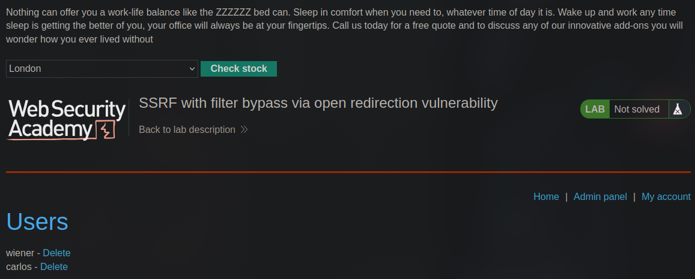
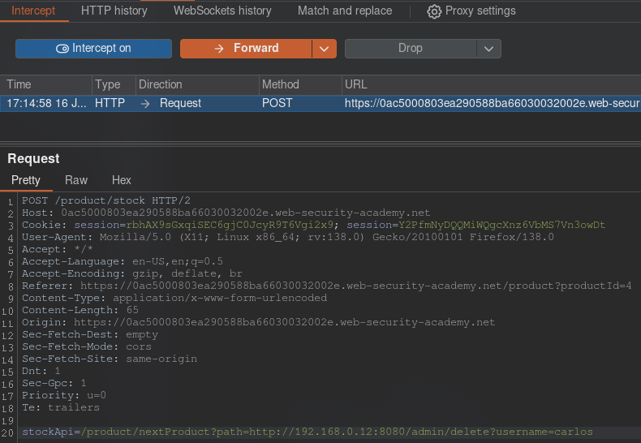
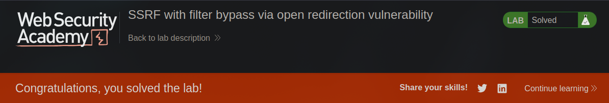

[Source](https://portswigger.net/web-security/ssrf/lab-ssrf-filter-bypass-via-open-redirection)
## Task
To solve the problem, change the check stock URL to access the admin interface at http://192.168.0.12:8080/admin and remove the user `carlos`.

The check stock was restricted to access only the local application, so you first need to find the open redirect affecting the application.
## Solution
Go to the lab site, go to any product page, click `Check stock` and intercept the request in `Burp Suite`.



Send the request to `Repeater`.



We see that this does not allow us to bypass the protection. Let's try to click the `Next product` button and intercept this request



We see the line here:
```URL
/product/nextProduct?currentProductId=3&path=/product?productId=4
```
It contains `path=...`, which we can exploit by changing `/product?productId=4` to `http://192.168.0.12:8080/admin`. As a result, we get the following link:
```URL
/product/nextProduct?path=http://192.168.0.12:8080/admin
```
Let's move on to the `Check stock` request and insert a new link there:






We have gained access to the admin panel. Let's delete the user.



Lab work completed


