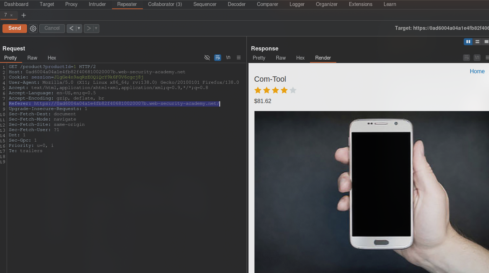
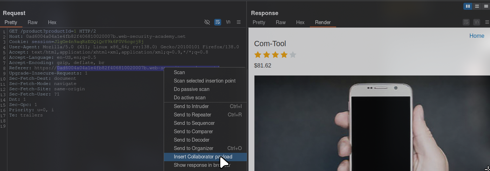
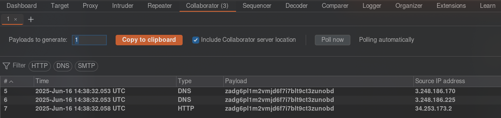
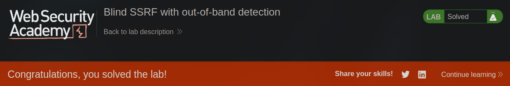

[Source](https://portswigger.net/web-security/ssrf/blind/lab-out-of-band-detection)
## Task
This site uses analytics software that requests the URL specified in the `Referer` header when loading a product page.
To solve the task, use this functionality to make an HTTP request to the public Burp Collaborator server.
> [!info] Note
To prevent third-party attacks through the Academy platform, our firewall blocks communication between labs and arbitrary external systems. To solve the task, **required** to use the default public Burp Collaborator server.
## Solution
Open the site, go to any product page and intercept the request. Send it to `Repeater`

We see that there is a `Referer`. Here you need to select the address, right-click and select `Insert Collaborator payload`.

> [!important] Important!
> The address in `Referer` must be with `http://` or `https://`

After that, send the request and go to the `Collaborator` tab. Click `Poll now`.

Lab work completed

